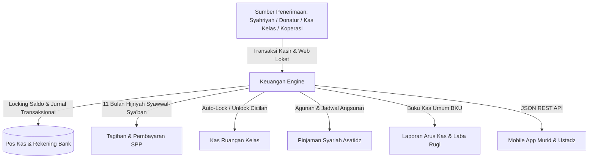
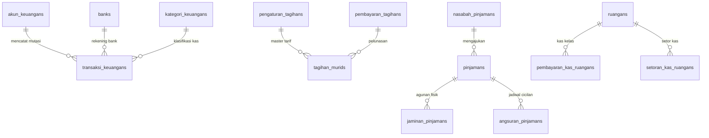
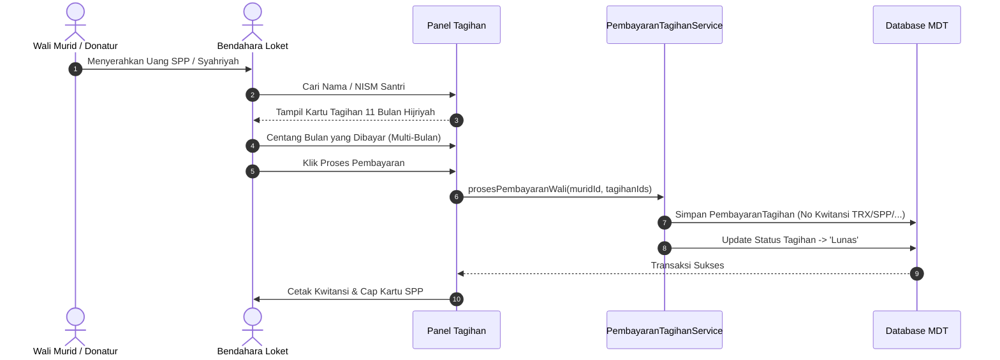
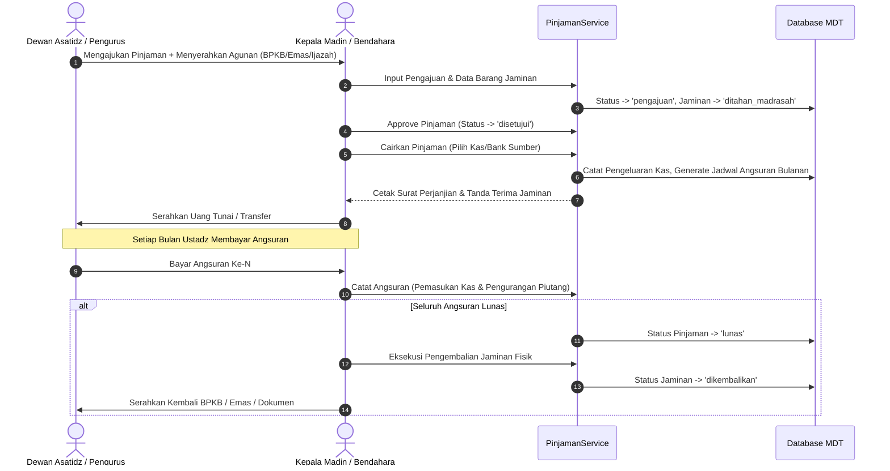

# 💰 MDT HIDAYATUS SHIBYAN - MASTER BLUEPRINT SISTEM KEUANGAN MADRASAH

> **Dokumen Tunggal Kebijakan, Arsitektur Sistem, Perbendaharaan Kas & Bank, Syahriyah 11 Bulan Hijriyah, Kas Ruangan, dan Pinjaman Syariah**  
> _Versi 2.0 — Terakhir Diperbarui: September 2026_  
> _Status: Single Source of Truth (SSOT) Modul Keuangan Madrasah_

---

## 📑 DAFTAR ISI

1. [Ringkasan Eksekutif & Filosofi Sistem](#-1-ringkasan-eksekutif--filosofi-sistem)
2. [Arsitektur & Skema Basis Data (Database Schema)](#-2-arsitektur--skema-basis-data-database-schema)
3. [Standar Syahriyah 11 Bulan Hijriyah & Penomoran Kwitansi](#-3-standar-syahriyah-11-bulan-hijriyah--penomoran-kwitansi)
4. [Logika Bisnis Keuangan & Rumus Perhitungan](#-4-logika-bisnis-keuangan--rumus-perhitungan)
5. [Spesifikasi Fitur & Alur Kerja Web Admin](#-5-spesifikasi-fitur--alur-kerja-web-admin)
   - 5.1. Perbendaharaan Pos Kas & Rekening Bank
   - 5.2. Kategori & Subkategori Arus Kas
   - 5.3. Transaksi Keuangan (Pemasukan, Pengeluaran, Mutasi Antar-Kas)
   - 5.4. Tagihan Murid & Cetak Kartu SPP Massal
   - 5.5. Pembayaran Syahriyah, Leger Massal & Donatur
   - 5.6. Kas Ruangan Kelas & Verifikasi Setoran
   - 5.7. Sistem Pinjaman Syariah / Kasbon Asatidz & Agunan
   - 5.8. Laporan Buku Kas Umum (BKU), Cash Flow & Portofolio
6. [Integrasi Lintas Modul (Cross-Module Ecosystem)](#-6-integrasi-lintas-modul-cross-module-ecosystem)
   - 6.1. Integrasi Tabungan Madrasah
   - 6.2. Integrasi Koperasi Madrasah
   - 6.3. Integrasi Aplikasi Mobile Murid & Ustadz
7. [Daftar Rute Web & REST API Endpoints](#-7-daftar-rute-web--rest-api-endpoints)
8. [Matriks Hak Akses & Keamanan (RBAC)](#-8-matriks-hak-akses--keamanan-rbac)
9. [Standar Operasional Prosedur (SOP) & Troubleshooting](#-9-standar-operasional-prosedur-sop--troubleshooting)

---

## 🌟 1. RINGKASAN EKSEKUTIF & FILOSOFI SISTEM

Modul **Keuangan Madrasah** di Madrasah Diniyah Takmiliyah (MDT) Hidayatus Shibyan dirancang sebagai pusat kendali perbendaharaan dan akuntansi syariah yang mengelola seluruh arus kas masuk, kas keluar, piutang syahriyah santri, kas kelas ruangan, dan pinjaman kebajikan (_Qardh Hasan_) bagi dewan asatidz/pengurus.



### Prinsip Utama Sistem:

1. **Kalender Keuangan Syariah (11 Bulan Hijriyah):** Perhitungan SPP tahunan madrasah dihitung berbasis 11 bulan Hijriyah aktif (dimulai dari bulan _Syawwal_ hingga _Sya'ban_, libur Ramadan).
2. **Multi-Akun & Rekening Bank Terisolasi:** Memisahkan pos dana secara ketat (Kas Utama, Kas Operasional, Kas Pembangunan, Kas Sosial, Kas Tabungan, dan Kas Koperasi) serta rekening bank resmi (BSI, Bank Jatim Syariah, BRI).
3. **Integritas Transaksional (ACID & No-Negative-Balance):** Pengeluaran atau mutasi kas secara otomatis dicek agar tidak menyebabkan saldo kas/bank menjadi minus, dan pembatalan (_void_) transaksi melakukan _rollback_ saldo secara presisi.
4. **Pinjaman Kebajikan (_Qardh Hasan_) dengan Agunan Aman:** Memfasilitasi pinjaman darurat bagi asatidz/pengurus dengan pencatatan jaminan fisik (BPKB, Sertifikat, Emas, Ijazah) yang tersimpan di brankas madrasah.

---

## 🗄️ 2. ARSITEKTUR & SKEMA BASIS DATA (DATABASE SCHEMA)

Sistem Keuangan didukung oleh 12 tabel basis data yang saling terhubung:



### 2.1. Tabel `akun_keuangans` (Pos Kas & Buku Keuangan)

Menyimpan master buku kas dan pos anggaran madrasah.

| Kolom            | Tipe Data                                                            | Keterangan                                             |
| :--------------- | :------------------------------------------------------------------- | :----------------------------------------------------- |
| `id`             | `BIGINT UNSIGNED (PK)`                                               | Primary Key.                                           |
| `kode_akun`      | `VARCHAR(50) (UNIQUE)`                                               | Kode akun (contoh: `KAS-01`, `KAS-OPS`, `KAS-BANGUN`). |
| `nama_akun`      | `VARCHAR(150)`                                                       | Label pos kas (contoh: "Kas Utama Madrasah").          |
| `tipe_akun`      | `ENUM('kas','bank','operasional','investasi','kewajiban','ekuitas')` | Klasifikasi pos akun.                                  |
| `saldo_awal`     | `DECIMAL(15,2)`                                                      | Saldo awal pembukaan buku.                             |
| `saldo_berjalan` | `DECIMAL(15,2)`                                                      | **Saldo Kas Berjalan Real-time**.                      |
| `deskripsi`      | `TEXT (Nullable)`                                                    | Keterangan peruntukan akun.                            |
| `is_active`      | `BOOLEAN (Default: 1)`                                               | Status keaktifan pos kas.                              |

---

### 2.2. Tabel `banks` (Master Rekening Bank Madrasah)

Menyimpan rekening bank resmi atas nama lembaga/yayasan.

| Kolom            | Tipe Data                 | Keterangan                                                |
| :--------------- | :------------------------ | :-------------------------------------------------------- |
| `id`             | `BIGINT UNSIGNED (PK)`    | Primary Key.                                              |
| `nama_bank`      | `VARCHAR(100)`            | Contoh: Bank Syariah Indonesia (BSI), Bank Jatim Syariah. |
| `kode_bank`      | `VARCHAR(20) (Nullable)`  | Kode transfer bank (contoh: `451`).                       |
| `nomor_rekening` | `VARCHAR(50)`             | Nomor rekening bank resmi.                                |
| `atas_nama`      | `VARCHAR(150)`            | Nama pemilik rekening resmi.                              |
| `cabang`         | `VARCHAR(150) (Nullable)` | Kantor cabang pembukaan rekening.                         |
| `saldo`          | `DECIMAL(15,2)`           | **Saldo Rekening Bank Terkini**.                          |
| `is_default`     | `BOOLEAN (Default: 0)`    | Rekening default penerimaan transfer.                     |
| `is_active`      | `BOOLEAN (Default: 1)`    | Status aktif rekening bank.                               |

---

### 2.3. Tabel `kategori_keuangans` (Hierarki Kategori Arus Kas)

Master klasifikasi penerimaan dan pengeluaran kas.

| Kolom           | Tipe Data                                    | Keterangan                                              |
| :-------------- | :------------------------------------------- | :------------------------------------------------------ |
| `id`            | `BIGINT UNSIGNED (PK)`                       | Primary Key.                                            |
| `parent_id`     | `BIGINT UNSIGNED (FK, Nullable)`             | Parent kategori (untuk struktur subkategori).           |
| `kode_kategori` | `VARCHAR(50) (UNIQUE)`                       | Kode unik (contoh: `KAT-IN-01`, `KAT-OUT-02`).          |
| `nama_kategori` | `VARCHAR(150)`                               | Contoh: Syahriyah Santri, Honor Asatidz, Listrik & Air. |
| `jenis`         | `ENUM('pemasukan','pengeluaran','simpanan')` | Arah arus kas kategori.                                 |
| `deskripsi`     | `TEXT (Nullable)`                            | Keterangan kategori.                                    |
| `is_active`     | `BOOLEAN (Default: 1)`                       | Status aktif opsi.                                      |

---

### 2.4. Tabel `transaksi_keuangans` (Jurnal Umum Buku Kas)

Buku besar transaksi kas masuk, kas keluar, dan mutasi antar-kas/bank.

| Kolom                  | Tipe Data                                             | Keterangan                                          |
| :--------------------- | :---------------------------------------------------- | :-------------------------------------------------- |
| `id`                   | `BIGINT UNSIGNED (PK)`                                | Primary Key.                                        |
| `kode_transaksi`       | `VARCHAR(50) (UNIQUE)`                                | Format: `IN-YYYYMMDD-XXXX` / `OUT-...` / `MUT-...`. |
| `tahun_pelajaran_id`   | `BIGINT UNSIGNED (FK)`                                | Relasi ke tahun pelajaran aktif.                    |
| `akun_keuangan_id`     | `BIGINT UNSIGNED (FK)`                                | Relasi ke pos kas sumber/penerima.                  |
| `kategori_keuangan_id` | `BIGINT UNSIGNED (FK, Nullable)`                      | Relasi ke kategori keuangan.                        |
| `jenis_transaksi`      | `ENUM('pemasukan','pengeluaran','mutasi','simpanan')` | Tipe mutasi jurnal kas.                             |
| `metode_pembayaran`    | `ENUM('tunai','transfer_bank')`                       | Kanal fisik pembayaran.                             |
| `bank_id`              | `BIGINT UNSIGNED (FK, Nullable)`                      | Relasi ke rekening bank terkait.                    |
| `akun_tujuan_id`       | `BIGINT UNSIGNED (FK, Nullable)`                      | Pos kas tujuan (khusus mutasi antar-kas).           |
| `bank_tujuan_id`       | `BIGINT UNSIGNED (FK, Nullable)`                      | Rekening bank tujuan (khusus mutasi antar-bank).    |
| `nominal`              | `DECIMAL(15,2)`                                       | Nilai uang transaksi.                               |
| `tanggal_transaksi`    | `DATE`                                                | Tanggal efektif transaksi.                          |
| `nomor_referensi`      | `VARCHAR(100) (Nullable)`                             | Nomor nota/struk/dokumen pendukung.                 |
| `keterangan`           | `TEXT (Nullable)`                                     | Berita acara atau rincian transaksi.                |
| `bukti_transaksi`      | `VARCHAR(255) (Nullable)`                             | Path file foto kwitansi/nota/slip transfer.         |
| `user_id`              | `BIGINT UNSIGNED (FK)`                                | User ID bendahara pembuat transaksi.                |
| `status`               | `ENUM('draft','sukses','batal')`                      | Status transaksi.                                   |

---

### 2.5. Tabel `pengaturan_tagihans` (Tarif Master Tagihan Santri)

Master konfigurasi tarif iuran santri per level atau global.

| Kolom                | Tipe Data                                 | Keterangan                                         |
| :------------------- | :---------------------------------------- | :------------------------------------------------- |
| `id`                 | `BIGINT UNSIGNED (PK)`                    | Primary Key.                                       |
| `tahun_pelajaran_id` | `BIGINT UNSIGNED (FK)`                    | Relasi ke tahun pelajaran.                         |
| `level_id`           | `BIGINT UNSIGNED (FK, Nullable)`          | Kelas spesifik (Null = Berlaku Seluruh Level).     |
| `kode_tagihan`       | `VARCHAR(50)`                             | Kode tarif (contoh: `SPP`, `UJIAN`, `SERAGAM`).    |
| `nama_tagihan`       | `VARCHAR(150)`                            | Label tagihan (contoh: "Syahriyah Bulanan Madin"). |
| `tipe`               | `ENUM('bulanan','semester','insidental')` | Siklus penagihan.                                  |
| `nominal`            | `BIGINT`                                  | Nominal tarif tagihan (Rupiah).                    |

---

### 2.6. Tabel `pembayaran_tagihans` (Header Pembayaran SPP & Donatur)

Kwitansi resmi pelunasan tagihan santri.

| Kolom               | Tipe Data               | Keterangan                                  |
| :------------------ | :---------------------- | :------------------------------------------ |
| `id`                | `BIGINT UNSIGNED (PK)`  | Primary Key.                                |
| `no_transaksi`      | `VARCHAR(100) (UNIQUE)` | Format: `TRX/SPP/NISM/YYYY/MM/XXXXX`.       |
| `tanggal_bayar`     | `DATE`                  | Tanggal pelunasan.                          |
| `tipe_pembayar`     | `VARCHAR(50)`           | 'Wali Murid', 'Donatur', 'Beasiswa'.        |
| `nama_pembayar`     | `VARCHAR(150)`          | Nama orang tua / donatur penyetor.          |
| `metode_pembayaran` | `VARCHAR(50)`           | 'Tunai', 'Transfer BSI', 'Potong Tabungan'. |
| `total_nominal`     | `BIGINT`                | Total uang yang dibayarkan.                 |
| `catatan`           | `TEXT (Nullable)`       | Catatan kwitansi pembayaran.                |

---

### 2.7. Tabel `tagihan_murids` (Kartu Piutang Tagihan Santri)

Daftar kewajiban pembayaran santri per bulan Hijriyah atau per semester.

| Kolom                   | Tipe Data                                                         | Keterangan                                     |
| :---------------------- | :---------------------------------------------------------------- | :--------------------------------------------- |
| `id`                    | `BIGINT UNSIGNED (PK)`                                            | Primary Key.                                   |
| `murid_id`              | `BIGINT UNSIGNED (FK)`                                            | Relasi ke `murids.id`.                         |
| `ruangan_id`            | `BIGINT UNSIGNED (FK)`                                            | Ruangan kelas santri saat tagihan diterbitkan. |
| `pengaturan_tagihan_id` | `BIGINT UNSIGNED (FK)`                                            | Relasi ke master tarif.                        |
| `bulan_hijriyah_id`     | `BIGINT UNSIGNED (FK, Nullable)`                                  | Relasi ke bulan Hijriyah (untuk tipe bulanan). |
| `semester_id`           | `BIGINT UNSIGNED (FK, Nullable)`                                  | Relasi ke semester (untuk ujian/rapor).        |
| `nama_tagihan_spesifik` | `VARCHAR(200)`                                                    | Contoh: "Syahriyah Syawwal 1448 H".            |
| `nominal_tagihan`       | `BIGINT`                                                          | Nilai tagihan santri.                          |
| `status_bayar`          | `ENUM('Belum Lunas','Lunas','Bebas/Gratis','Ditanggung Donatur')` | Status pelunasan.                              |
| `pembayaran_tagihan_id` | `BIGINT UNSIGNED (FK, Nullable)`                                  | Relasi ke kwitansi pelunasan.                  |

---

### 2.8. Tabel `nasabah_pinjamans` (Master Peminjam Syariah)

Profil peminjam (Asatidz, Pengurus, Karyawan, Umum/Wali).

| Kolom           | Tipe Data                                       | Keterangan                      |
| :-------------- | :---------------------------------------------- | :------------------------------ |
| `id`            | `BIGINT UNSIGNED (PK)`                          | Primary Key.                    |
| `kode_nasabah`  | `VARCHAR(50) (UNIQUE)`                          | Format: `NSB-XXXXX`.            |
| `tipe_nasabah`  | `ENUM('ustadz','pengurus','wali_murid','umum')` | Kategori peminjam.              |
| `ustadz_id`     | `BIGINT UNSIGNED (FK, Nullable)`                | Relasi ke ustadz jika asatidz.  |
| `wali_murid_id` | `BIGINT UNSIGNED (FK, Nullable)`                | Relasi ke wali murid jika wali. |
| `nama_lengkap`  | `VARCHAR(150)`                                  | Nama lengkap nasabah.           |
| `nik_ktp`       | `VARCHAR(30) (Nullable)`                        | Nomor KTP / Identitas.          |
| `no_hp`         | `VARCHAR(30)`                                   | Nomor WhatsApp peminjam.        |
| `alamat`        | `TEXT`                                          | Alamat domisili lengkap.        |
| `foto_ktp`      | `VARCHAR(255) (Nullable)`                       | Foto KTP peminjam.              |
| `foto_nasabah`  | `VARCHAR(255) (Nullable)`                       | Pasfoto nasabah peminjam.       |
| `is_active`     | `BOOLEAN (Default: 1)`                          | Status aktif nasabah.           |

---

### 2.9. Tabel `pinjamans` (Akad Pinjaman & Fasilitas Kredit)

Dokumen akad pinjaman syariah (_Qardh Hasan_) dan kasbon.

| Kolom                         | Tipe Data                                                             | Keterangan                                          |
| :---------------------------- | :-------------------------------------------------------------------- | :-------------------------------------------------- |
| `id`                          | `BIGINT UNSIGNED (PK)`                                                | Primary Key.                                        |
| `kode_pinjaman`               | `VARCHAR(50) (UNIQUE)`                                                | Format: `PJ-YYYYMM-XXXX`.                           |
| `tahun_pelajaran_id`          | `BIGINT UNSIGNED (FK)`                                                | Relasi ke tahun pelajaran.                          |
| `nasabah_pinjaman_id`         | `BIGINT UNSIGNED (FK)`                                                | Relasi ke nasabah peminjam.                         |
| `akun_keuangan_id`            | `BIGINT UNSIGNED (FK)`                                                | Pos kas sumber pencairan dana.                      |
| `bank_id`                     | `BIGINT UNSIGNED (FK, Nullable)`                                      | Rekening bank jika ditransfer.                      |
| `nominal_pinjaman`            | `DECIMAL(15,2)`                                                       | Nilai pokok pinjaman yang disetujui.                |
| `biaya_administrasi`          | `DECIMAL(15,2) (Default: 0)`                                          | Biaya admin (infaq madrasah).                       |
| `nominal_pencairan`           | `DECIMAL(15,2)`                                                       | Uang tunai bersih yang dicairkan (`pokok - admin`). |
| `tenor_bulan`                 | `INT`                                                                 | Jangka waktu cicilan (bulan).                       |
| `margin_infaq_persen`         | `DECIMAL(5,2) (Default: 0)`                                           | Persentase infaq sukarela per tahun.                |
| `nominal_infaq_bulanan`       | `DECIMAL(15,2) (Default: 0)`                                          | Infaq bulanan yang disepakati.                      |
| `nominal_angsuran_pokok`      | `DECIMAL(15,2)`                                                       | Pokok per bulan (`nominal_pinjaman / tenor`).       |
| `nominal_angsuran_total`      | `DECIMAL(15,2)`                                                       | Total angsuran bulanan (`pokok + infaq`).           |
| `total_pinjaman_dikembalikan` | `DECIMAL(15,2)`                                                       | Total uang yang harus dikembalikan.                 |
| `total_terbayar`              | `DECIMAL(15,2) (Default: 0)`                                          | Akumulasi angsuran yang telah lunas.                |
| `sisa_pinjaman`               | `DECIMAL(15,2)`                                                       | Sisa pokok pinjaman yang belum lunas.               |
| `tanggal_pengajuan`           | `DATE`                                                                | Tanggal formulir diajukan.                          |
| `tanggal_pencairan`           | `DATE (Nullable)`                                                     | Tanggal uang diserahkan ke nasabah.                 |
| `tanggal_jatuh_tempo`         | `DATE (Nullable)`                                                     | Tanggal akhir jatuh tempo pelunasan.                |
| `keperluan_pinjaman`          | `TEXT`                                                                | Alasan/keperluan peminjaman dana.                   |
| `status`                      | `ENUM('pengajuan','disetujui','dicairkan','lunas','macet','ditolak')` | Status akad pinjaman.                               |
| `disetujui_oleh`              | `BIGINT UNSIGNED (FK, Nullable)`                                      | User ID kepala madrasah / bendahara.                |
| `dicairkan_oleh`              | `BIGINT UNSIGNED (FK, Nullable)`                                      | User ID kasir pencairan.                            |

---

### 2.10. Tabel `jaminan_pinjamans` (Agunan Jaminan Fisik)

Pencatatan agunan barang berharga yang disimpan di brankas madrasah.

| Kolom                   | Tipe Data                                                                                                             | Keterangan                                    |
| :---------------------- | :-------------------------------------------------------------------------------------------------------------------- | :-------------------------------------------- |
| `id`                    | `BIGINT UNSIGNED (PK)`                                                                                                | Primary Key.                                  |
| `pinjaman_id`           | `BIGINT UNSIGNED (FK)`                                                                                                | Relasi ke `pinjamans.id`.                     |
| `jenis_jaminan`         | `ENUM('bpkb_motor','bpkb_mobil','sertifikat_tanah','emas_perhiasan','ijazah','buku_tabungan','elektronik','lainnya')` | Jenis agunan.                                 |
| `nama_barang_jaminan`   | `VARCHAR(200)`                                                                                                        | Contoh: BPKB Honda Vario 160 Nopol W 4122 AA. |
| `nomor_dokumen_jaminan` | `VARCHAR(100) (Nullable)`                                                                                             | Nomor seri surat/sertifikat/BPKB.             |
| `atas_nama_dokumen`     | `VARCHAR(150) (Nullable)`                                                                                             | Nama pemilik yang tertera di dokumen.         |
| `taksiran_nilai`        | `DECIMAL(15,2)`                                                                                                       | Nilai taksiran pasar barang agunan.           |
| `lokasi_penyimpanan`    | `VARCHAR(150) (Default: 'Brankas MDT')`                                                                               | Posisi fisik penyimpanan brankas.             |
| `foto_dokumen`          | `VARCHAR(255) (Nullable)`                                                                                             | Foto surat kepemilikan.                       |
| `foto_barang`           | `VARCHAR(255) (Nullable)`                                                                                             | Foto fisik barang agunan.                     |
| `status_jaminan`        | `ENUM('ditahan_madrasah','dikembalikan','disita_dilelang')`                                                           | Status fisik agunan.                          |
| `tanggal_diserahkan`    | `DATE`                                                                                                                | Tanggal masuk brankas madrasah.               |
| `tanggal_dikembalikan`  | `DATE (Nullable)`                                                                                                     | Tanggal serah terima kembali ke nasabah.      |

---

### 2.11. Tabel `angsuran_pinjamans` (Jadwal & Kartu Cicilan Bulanan)

Buku angsuran cicilan pinjaman bulanan.

| Kolom                  | Tipe Data                                 | Keterangan                                    |
| :--------------------- | :---------------------------------------- | :-------------------------------------------- |
| `id`                   | `BIGINT UNSIGNED (PK)`                    | Primary Key.                                  |
| `pinjaman_id`          | `BIGINT UNSIGNED (FK)`                    | Relasi ke `pinjamans.id`.                     |
| `angsuran_ke`          | `INT`                                     | Urutan cicilan (1 s.d. Tenor).                |
| `tanggal_jatuh_tempo`  | `DATE`                                    | Tanggal wajib bayar setiap bulan.             |
| `tanggal_bayar`        | `DATE (Nullable)`                         | Tanggal pembayaran aktual.                    |
| `nominal_pokok`        | `DECIMAL(15,2)`                           | Nilai pokok cicilan.                          |
| `nominal_infaq_margin` | `DECIMAL(15,2)`                           | Infaq kebajikan sukarela.                     |
| `nominal_denda`        | `DECIMAL(15,2) (Default: 0)`              | Denda keterlambatan (jika ada).               |
| `total_bayar`          | `DECIMAL(15,2)`                           | Total uang cicilan (`pokok + infaq + denda`). |
| `metode_pembayaran`    | `ENUM('tunai','transfer_bank')`           | Kanal bayar angsuran.                         |
| `nomor_bukti_bayar`    | `VARCHAR(100) (Nullable)`                 | Nomor kwitansi angsuran.                      |
| `status`               | `ENUM('belum_bayar','lunas','terlambat')` | Status cicilan.                               |
| `diterima_oleh`        | `BIGINT UNSIGNED (FK, Nullable)`          | User ID kasir penerima.                       |

---

## 🌙 3. STANDAR SYAHRIYAH 11 BULAN HIJRIYAH & PENOMORAN KWITANSI

MDT Hidayatus Shibyan menerapkan kalender pendidikan Diniyah berbasis **11 Bulan Hijriyah**:

```text
Urutan 11 Bulan Hijriyah Pembayaran Syahriyah:
1. Syawwal (Awal Tahun Ajaran)   7. Rabi'ul Awwal
2. Dzulqa'dah                    8. Rabi'ul Akhir
3. Dzulhijjah                    9. Jumadil Awwal
4. Muharram                     10. Jumadil Akhir
5. Shafar                       11. Rajab / Sya'ban (Akhir Periode)
*(Bulan Ramadan libur / bebas biaya syahriyah bulanan)*
```

### Standar Penomoran Dokumen Keuangan:

1. **Kwitansi SPP/Tagihan:** `TRX/[KODE]/[NISM]/[YYYY]/[DDMM]/[RANDOM]`  
   ➔ Contoh: `TRX/SPP/2024001/2026/1009/84921`
2. **Transaksi Jurnal Kas:** `[IN/OUT/MUT]-[YYYYMMDD]-[URUT]`  
   ➔ Contoh: `IN-20260910-0001` (Kas Masuk), `OUT-20260910-0002` (Kas Keluar)
3. **Akad Pinjaman:** `PJ-[YYYYMM]-[URUT]`  
   ➔ Contoh: `PJ-202609-0001`
4. **Kwitansi Angsuran:** `KW-ANG-[YYYYMMDD]-[ID]`  
   ➔ Contoh: `KW-ANG-20260910-0012`

---

## 📐 4. LOGIKA BISNIS KEUANGAN & RUMUS PERHITUNGAN

### 4.1. Formula Pinjaman Syariah & Angsuran Bulanan

$$\text{Nominal Pencairan} = \text{Nominal Pinjaman} - \text{Biaya Administrasi}$$

$$\text{Angsuran Pokok Bulanan} = \frac{\text{Nominal Pinjaman}}{\text{Tenor Bulan}}$$

$$\text{Infaq Bulanan} = \frac{\text{Nominal Pinjaman} \times (\text{Margin Infaq \%} / 100)}{\text{Tenor Bulan}}$$

$$\text{Total Angsuran per Bulan} = \text{Angsuran Pokok Bulanan} + \text{Infaq Bulanan}$$

### 4.2. Arus Kas Bersih (Net Cash Flow) Buku Kas Umum (BKU)

$$\text{Total Pemasukan Periode} = \sum \text{Nominal Transaksi (Pemasukan + Simpanan)}$$

$$\text{Total Pengeluaran Periode} = \sum \text{Nominal Transaksi (Pengeluaran)}$$

$$\text{Net Cash Flow} = \text{Total Pemasukan Periode} - \text{Total Pengeluaran Periode}$$

$$\text{Total Saldo Likuid Lembaga} = \sum \text{Saldo Berjalan Akun Kas} + \sum \text{Saldo Rekening Bank}$$

---

## 🖥️ 5. SPESIFIKASI FITUR & ALUR KERJA WEB ADMIN

### 5.1. Perbendaharaan Pos Kas & Rekening Bank (`/keuangan/akun` & `/keuangan/bank`)

- **Master Pos Kas:** Buat pos anggaran kas (Kas Utama, Kas Operasional, Kas Pembangunan, Kas Sosial, dsb.).
- **Master Bank:** Kelola rekening bank resmi lembaga (BSI, Bank Jatim Syariah, BCA) dengan pemantauan saldo real-time.
- **Toggle Status:** Nonaktifkan rekening/pos kas yang tidak digunakan tanpa menghilangkan catatan riwayat mutasi.

---

### 5.2. Kategori & Subkategori Arus Kas (`/keuangan/kategori`)

- **Hierarki Multi-Level:** Mendukung struktur Kategori Induk dan Subkategori (contoh: Induk `Operasional Kantor` ➔ Sub `Listrik`, `Air PDAM`, `Internet WiFi`).
- **Filter Jenis:** Pengelompokan tegas antara `Pemasukan`, `Pengeluaran`, dan `Simpanan`.

---

### 5.3. Transaksi Keuangan Jurnal Umum (`/keuangan/transaksi`)

- **Pencatatan 3 Jenis Alur Kas:**
  1. **Pemasukan:** Menambah saldo pos kas / rekening bank penerima.
  2. **Pengeluaran:** Memvalidasi ketersediaan saldo (mencegah saldo minus) dan mengurangi saldo kas/bank sumber.
  3. **Mutasi Antar-Kas/Bank:** Memindahkan saldo dari Kas A / Bank A ke Kas B / Bank B secara atomik.
- **Lampiran Bukti Fisik:** Upload foto nota kuitansi, faktur belanja, atau bukti transfer.
- **Cetak Kwitansi Transaksi:** Dokumen cetak tanda terima kas masuk/keluar resmi bertanda tangan bendahara.
- **Void / Pembatalan Transaksi:** Mengembalikan (_rollback_) posisi saldo kas/bank ke kondisi semula dengan alasan pembatalan tertulis.

---

### 5.4. Tagihan Murid & Cetak Kartu SPP Massal (`/tagihan-murid`)

- **Distribusi Tagihan Otomatis:** Men-generate tagihan syahriyah 11 bulan Hijriyah untuk seluruh murid aktif.
- **Cetak Kartu SPP Digital/Fisik:**
  - Cetak kartu SPP individual per anak.
  - **Cetak Kartu SPP Massal 1 Ruangan:** Mencetak seluruh kartu SPP satu kelas dalam urutan nomor absen santri.

---

### 5.5. Pembayaran Syahriyah, Leger & Donatur (`/pembayaran-tagihan`)



- **Pelayanan Loket Kasir:** Mendukung pembayaran multi-bulan sekaligus (misal: Syawwal + Dzulqa'dah + Dzulhijjah).
- **Leger Pembayaran Massal:** Fitur entri cepat pembayaran SPP serentak satu kelas untuk mempercepat rekapitulasi bulanan.
- **Modul Donatur & Kafalah Santri:** Fasilitas bagi donatur untuk menanggung SPP santri yatim/dhuafa dengan status tagihan `Ditanggung Donatur`.

---

### 5.6. Kas Ruangan Kelas & Verifikasi Setoran (`/kas-ruangan`)

- **Pengaturan Kas Kelas:** Menetapkan iuran kas mingguan/bulanan per ruangan kelas.
- **Pencatatan Pembayaran Kas Santri:** Entri cicilan kas santri yang dipegang oleh bendahara kelas / wali ruangan.
- **Pengajuan Setoran Kas ke Bendahara:** Wali ruangan mengajukan penyerahan uang kas fisik ke bendahara madrasah (`setoran-kas-ruangan`).
- **Auto-Locking Cicilan:** Saat setoran kas diverifikasi oleh bendahara umum, cicilan kas murid otomatis dikunci (`is_disetor = true`) untuk mencegah manipulasi.

---

### 5.7. Sistem Pinjaman Syariah / Kasbon Asatidz & Agunan (`/keuangan/pinjaman`)



- **Pendaftaran Agunan Fisik:** Mencatat nomor dokumen, taksiran nilai, lokasi brankas, foto BPKB/sertifikat, dan tanda terima penyerahan agunan.
- **Pencairan Terhubung Kas:** Saat dicairkan, sistem otomatis menerbitkan jurnal pengeluaran kas/bank dan men-generate kartu jadwal angsuran bulanan.
- **Pembayaran Angsuran:** Setiap setoran cicilan menambah kas madrasah dan mengurangi sisa saldo pokok hutang nasabah.
- **Pengembalian Agunan:** Setelah pinjaman berstatus `lunas`, sistem memfasilitasi berita acara serah terima pengembalian dokumen jaminan ke nasabah.

---

### 5.8. Laporan Buku Kas Umum (BKU) & Portofolio (`/keuangan/laporan`)

- **Buku Kas Umum (BKU):** Menampilkan buku mutasi kronologis kas masuk, kas keluar, dan saldo berjalan dengan filter rentang tanggal dan pos akun.
- **Laporan Breakdown Kategori:** Rekapitulasi persentase pos pengeluaran terbesar (honor asatidz, operasional, sarana, dsb.).
- **Laporan Portofolio Pinjaman:** Rekap total pinjaman dicairkan, total pengembalian, sisa piutang berjalan, dan status agunan fisik yang tersimpan di brankas.
- **Ekspor Dokumen Cetak:** Format cetak dokumen standar audit perbendaharaan yayasan.

---

## 🔗 6. INTEGRASI LINTAS MODUL (CROSS-MODULE ECOSYSTEM)

### 6.1. Integrasi Tabungan Madrasah

- **Setoran Kas Ruangan ke Tabungan:** Kas kelas yang disetorkan dapat dialokasikan langsung masuk ke rekening tabungan kas ruangan madrasah.
- **Potongan Musyawarah:** Hasil potongan tabungan akhir tahun otomatis dibukukan sebagai pemasukan pos kas madrasah.

### 6.2. Integrasi Koperasi Madrasah

- **Penerimaan Omzet Koperasi:** Hasil penjualan koperasi madrasah disetorkan ke rekening kas operasional madrasah.
- **Permodalan Awal:** Pengadaan stok kulakan koperasi dapat didanai melalui pos kas investasi madrasah.

### 6.3. Integrasi Aplikasi Mobile Murid & Ustadz

- **App Murid (`app_murid`):** Wali murid dapat mengecek status tunggakan SPP 11 bulan Hijriyah, histori pembayaran, dan kartu SPP digital secara mandiri.
- **App Ustadz (`app_ustadz`):** Asatidz dapat memantau saldo kas ruangan binaannya dan mengecek kartu angsuran pinjaman aktif.

---

## 🛣️ 7. DAFTAR RUTE WEB & REST API ENDPOINTS

### 7.1. Rute Web Panel Admin (`/keuangan/...` & `/tagihan-...`)

| Method | URI Route                                            | Nama Rute Laravel                              | Kegunaan                                   |
| :----- | :--------------------------------------------------- | :--------------------------------------------- | :----------------------------------------- |
| `GET`  | `/tagihan-murid`                                     | `tagihan-murid.index`                          | Master kartu tagihan santri.               |
| `GET`  | `/tagihan-murid/cetak-kartu-spp/{m}/{t}`             | `tagihan-murid.cetak-kartu-spp`                | Cetak kartu SPP santri.                    |
| `GET`  | `/tagihan-murid/cetak-kartu-spp-massal/{r}/{t}`      | `tagihan-murid.cetak-kartu-spp-massal`         | Cetak kartu SPP massal per ruangan.        |
| `POST` | `/tagihan-murid/proses`                              | `tagihan-murid.proses`                         | Generate tagihan pilihan massal.           |
| `GET`  | `/pembayaran-tagihan`                                | `pembayaran-tagihan.index`                     | Loket kasir pembayaran syahriyah.          |
| `POST` | `/pembayaran-tagihan/proses`                         | `pembayaran-tagihan.proses`                    | Eksekusi pelunasan SPP santri.             |
| `POST` | `/pembayaran-tagihan/batal/{id}`                     | `pembayaran-tagihan.batal`                     | Batal / void kwitansi pembayaran SPP.      |
| `GET`  | `/pembayaran-tagihan/cetak/{id}`                     | `pembayaran-tagihan.cetak`                     | Cetak kwitansi pembayaran SPP.             |
| `GET`  | `/pembayaran-tagihan/leger`                          | `pembayaran-tagihan.leger`                     | Halaman pembayaran massal via Leger.       |
| `POST` | `/pembayaran-tagihan/leger/proses`                   | `pembayaran-tagihan.leger.proses`              | Eksekusi pelunasan massal via Leger.       |
| `GET`  | `/pembayaran-tagihan/donatur`                        | `pembayaran-tagihan.donatur`                   | Modul pembayaran tagihan via Donatur.      |
| `POST` | `/pembayaran-tagihan/donatur/proses`                 | `pembayaran-tagihan.donatur.proses`            | Eksekusi pelunasan tagihan donatur.        |
| `GET`  | `/pembayaran-tagihan/laporan`                        | `pembayaran-tagihan.laporan`                   | Laporan penerimaan syahriyah santri.       |
| `GET`  | `/pengaturan-tagihan`                                | `pengaturan-tagihan.index`                     | Master tarif tagihan madrasah.             |
| `GET`  | `/kas-ruangan`                                       | `kas-ruangan.index`                            | Dashboard kas ruangan kelas.               |
| `GET`  | `/kas-ruangan/{ruangan_id}`                          | `kas-ruangan.show`                             | Rincian pembayaran kas kelas murid.        |
| `POST` | `/kas-ruangan/bayar`                                 | `kas-ruangan.bayar`                            | Simpan pembayaran kas santri.              |
| `GET`  | `/setoran-kas-ruangan`                               | `setoran-kas-ruangan.index`                    | Daftar pengajuan setoran kas ke bendahara. |
| `POST` | `/setoran-kas-ruangan/{id}/verifikasi`               | `setoran-kas-ruangan.verifikasi`               | Verifikasi setoran kas ruangan.            |
| `GET`  | `/keuangan/akun`                                     | `keuangan.akun.index`                          | Master pos akun kas keuangan.              |
| `POST` | `/keuangan/akun`                                     | `keuangan.akun.store`                          | Tambah pos kas baru.                       |
| `GET`  | `/keuangan/bank`                                     | `keuangan.bank.index`                          | Master rekening bank madrasah.             |
| `POST` | `/keuangan/bank`                                     | `keuangan.bank.store`                          | Tambah rekening bank baru.                 |
| `GET`  | `/keuangan/kategori`                                 | `keuangan.kategori.index`                      | Master kategori penerimaan/pengeluaran.    |
| `GET`  | `/keuangan/transaksi`                                | `keuangan.transaksi.index`                     | Jurnal transaksi kas umum.                 |
| `POST` | `/keuangan/transaksi`                                | `keuangan.transaksi.store`                     | Simpan transaksi kas masuk/keluar/mutasi.  |
| `GET`  | `/keuangan/transaksi/cetak-kwitansi/{id}`            | `keuangan.transaksi.cetak-kwitansi`            | Cetak kwitansi transaksi kas.              |
| `POST` | `/keuangan/transaksi/{id}/batal`                     | `keuangan.transaksi.batal`                     | Batalkan / void transaksi kas.             |
| `GET`  | `/keuangan/nasabah`                                  | `keuangan.nasabah.index`                       | Direktori nasabah peminjam syariah.        |
| `GET`  | `/keuangan/pinjaman`                                 | `keuangan.pinjaman.index`                      | Daftar akad pinjaman & kasbon asatidz.     |
| `POST` | `/keuangan/pinjaman`                                 | `keuangan.pinjaman.store`                      | Buat pengajuan pinjaman & agunan baru.     |
| `POST` | `/keuangan/pinjaman/{id}/approve`                    | `keuangan.pinjaman.approve`                    | Setujui pengajuan pinjaman.                |
| `POST` | `/keuangan/pinjaman/{id}/cairkan`                    | `keuangan.pinjaman.cairkan`                    | Pencairan dana pinjaman ke nasabah.        |
| `POST` | `/keuangan/pinjaman/{id}/bayar-angsuran`             | `keuangan.pinjaman.bayar-angsuran`             | Pembayaran angsuran cicilan pinjaman.      |
| `POST` | `/keuangan/pinjaman/{id}/kembalikan-jaminan`         | `keuangan.pinjaman.kembalikan-jaminan`         | Serah terima pengembalian agunan fisik.    |
| `GET`  | `/keuangan/pinjaman/{id}/cetak-perjanjian`           | `keuangan.pinjaman.cetak-perjanjian`           | Cetak surat perjanjian akad pinjaman.      |
| `GET`  | `/keuangan/pinjaman/{id}/cetak-tanda-terima-jaminan` | `keuangan.pinjaman.cetak-tanda-terima-jaminan` | Cetak tanda terima jaminan brankas.        |
| `GET`  | `/keuangan/pinjaman/{id}/cetak-kartu-angsuran`       | `keuangan.pinjaman.cetak-kartu-angsuran`       | Cetak kartu kontrol angsuran bulanan.      |
| `GET`  | `/keuangan/laporan`                                  | `keuangan.laporan.index`                       | Dashboard laporan keuangan & cash flow.    |
| `GET`  | `/keuangan/laporan/cetak-buku-kas`                   | `keuangan.laporan.cetak-buku-kas`              | Cetak dokumen Buku Kas Umum (BKU).         |
| `GET`  | `/keuangan/laporan/cetak-pinjaman`                   | `keuangan.laporan.cetak-pinjaman`              | Cetak laporan portofolio pinjaman.         |

---

### 7.2. Endpoint REST API Mobile (`/api/...`)

| Method | Endpoint API                    | Controller Action                    | Kegunaan                                            |
| :----- | :------------------------------ | :----------------------------------- | :-------------------------------------------------- |
| `GET`  | `/api/wali/anak/{id}/tagihan`   | `WaliMuridApiController@getTagihan`  | Mengambil status tagihan SPP santri (`app_murid`).  |
| `GET`  | `/api/wali/anak/{id}/kartu-spp` | `WaliMuridApiController@getKartuSpp` | Mengambil kartu SPP 11 bulan Hijriyah santri.       |
| `GET`  | `/api/kas-ruangan`              | `KasRuanganController@index`         | Mengambil status kas ruangan binaan (`app_ustadz`). |
| `POST` | `/api/kas-ruangan/bayar`        | `KasRuanganController@bayar`         | Input pembayaran kas santri oleh wali ruangan.      |

---

## 🛡️ 8. MATRIKS HAK AKSES & KEAMANAN (RBAC)

Hak akses modul Keuangan diatur ketat dengan Spatie Laravel Permission:

| Fitur / Modul Operasional            | Administrator |  Bendahara Umum  | Kasir / Staf Loket | Wali Ruangan (Ustadz) |    Wali Murid     |
| :----------------------------------- | :-----------: | :--------------: | :----------------: | :-------------------: | :---------------: |
| **Kelola Master Akun & Bank**        |    ✅ Full    |     ✅ Full      |   ❌ (View Only)   |          ❌           |        ❌         |
| **Kelola Kategori Keuangan**         |      ✅       |        ✅        |         ❌         |          ❌           |        ❌         |
| **Input Transaksi Kas Masuk/Keluar** |      ✅       |        ✅        |         ✅         |          ❌           |        ❌         |
| **Void / Batal Transaksi Kas**       |      ✅       |        ✅        |         ❌         |          ❌           |        ❌         |
| **Terima Pembayaran SPP/Tagihan**    |      ✅       |        ✅        |         ✅         |          ❌           |        ❌         |
| **Cetak Kartu SPP Massal**           |      ✅       |        ✅        |         ✅         |   ✅ (Kelas Binaan)   |        ❌         |
| **Kelola Kas Ruangan Kelas**         |      ✅       |        ✅        |         ❌         |   ✅ (Kelas Binaan)   |        ❌         |
| **Verifikasi Setoran Kas Ruangan**   |      ✅       |        ✅        |         ❌         |          ❌           |        ❌         |
| **Input Pengajuan Pinjaman**         |      ✅       |        ✅        |         ✅         |          ❌           |        ❌         |
| **Approve & Cairkan Pinjaman**       |      ✅       | ✅ (Persetujuan) |         ❌         |          ❌           |        ❌         |
| **Terima Bayar Angsuran Pinjaman**   |      ✅       |        ✅        |         ✅         |          ❌           |        ❌         |
| **Kembalikan Agunan Jaminan**        |      ✅       |        ✅        |         ❌         |          ❌           |        ❌         |
| **Lihat Buku Kas Umum & Laporan**    |      ✅       |        ✅        | ❌ (View Ringkas)  |          ❌           |        ❌         |
| **Lihat Kartu SPP & Tagihan Anak**   |      ❌       |        ❌        |         ❌         |          ❌           | ✅ (Anak Sendiri) |

---

## 📋 9. STANDAR OPERASIONAL PROSEDUR (SOP) & TROUBLESHOOTING

### 9.1. SOP Awal Tahun Pelajaran (Master Tarif & Tagihan)

1. **Atur Tarif Tagihan:** Buka `/pengaturan-tagihan`, tentukan tarif Syahriyah bulanan, Ujian, dan Seragam.
2. **Generate Tagihan Massal:** Masuk ke `/tagihan-murid`, sistem otomatis menerbitkan piutang 11 bulan Hijriyah untuk seluruh santri aktif.
3. **Cetak Kartu SPP:** Buka `/tagihan-murid`, klik **Cetak Kartu SPP Massal** per ruangan kelas untuk dibagikan kepada wali murid saat musyawarah awal tahun.

### 9.2. SOP Pelayanan Loket Kasir Harian

1. Wali murid datang ke loket pembayaran madrasah.
2. Buka menu `/pembayaran-tagihan`, ketik nama atau NISM santri.
3. Centang bulan Hijriyah yang hendak dibayarkan.
4. Masukkan nominal uang yang diterima, klik **Simpan & Cetak Kwitansi**.
5. Bubuhkan cap stempel madrasah pada kwitansi dan kartu SPP fisik santri.

### 9.3. SOP Pengelolaan Pinjaman Syariah Asatidz

1. **Pengajuan:** Masukkan formulir pinjaman di `/keuangan/pinjaman/create`, pilih nasabah, nominal, tenor, dan rincian barang agunan fisik.
2. **Serah Terima Agunan:** Masukkan BPKB/sertifikat/emas ke dalam brankas madrasah, cetak **Tanda Terima Jaminan**.
3. **Persetujuan & Pencairan:** Kepala madrasah menyetujui pinjaman ➔ bendahara mencairkan dana tunai/transfer ➔ cetak **Surat Perjanjian Pinjaman** bertanda tangan di atas meterai.
4. **Angsuran Bulanan:** Asatidz membayar cicilan bulanan di loket kasir ➔ sistem mencatat jurnal pemasukan kas dan mengurangi sisa pinjaman pada kartu angsuran.
5. **Pelunasan & Serah Terima Agunan:** Setelah cicilan lunas 100%, klik **Kembalikan Jaminan** dan serahkan kembali dokumen fisik kepada nasabah dengan berita acara resmi.

### 9.4. Troubleshooting & Kasus Khusus

- **Saldo Pos Kas / Bank Tidak Sesuai Fisik:**
  1. Buka menu `/keuangan/laporan`, cetak Buku Kas Umum (BKU) pada rentang tanggal terkait.
  2. Periksa baris transaksi pemasukan dan pengeluaran harian terhadap bukti nota fisik.
  3. Lakukan transaksi penyesuaian (_Koreksi Kas Masuk / Kas Keluar_) dengan berita acara tertulis jika terdapat selisih pembulatan/biaya admin bank.
- **Koreksi Salah Input Pembayaran SPP (Void):**
  1. Bendahara membuka menu `/pembayaran-tagihan`, cari nomor transaksi kuitansi terkait.
  2. Klik tombol **Batalkan Transaksi**, masukkan alasan pembatalan.
  3. Status tagihan murid otomatis kembali menjadi `Belum Lunas` dan jurnal kas disesuaikan seketika.
