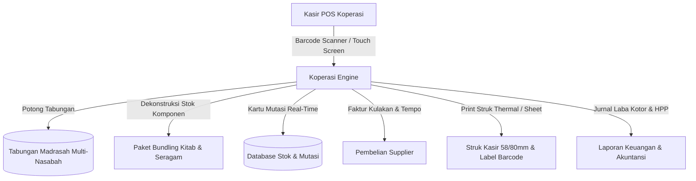
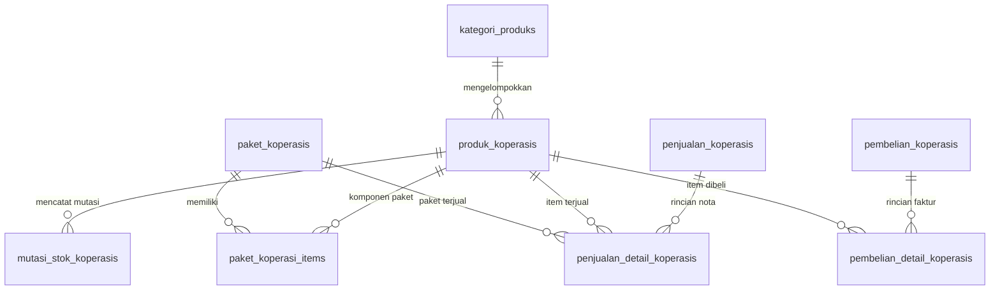
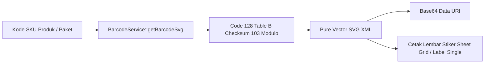
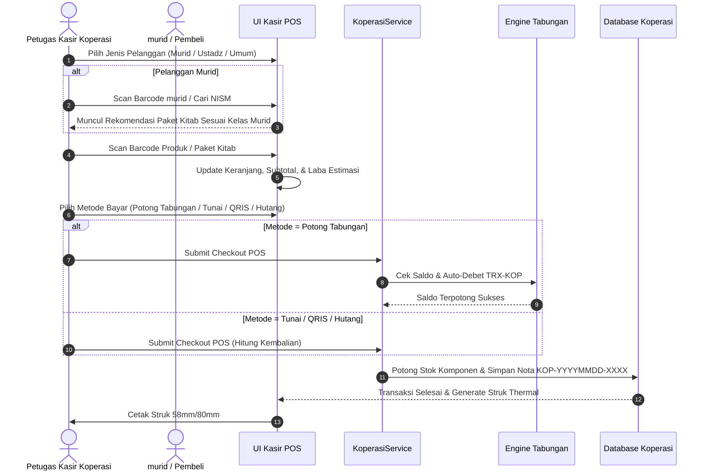

# 🛒 MDT HIDAYATUS SHIBYAN - MASTER BLUEPRINT SISTEM KOPERASI MADRASAH

> **Dokumen Tunggal Kebijakan, Arsitektur Sistem, Manajemen Inventaris, dan Panduan Operasional POS Kasir Koperasi Madrasah**  
> _Versi 2.0 — Terakhir Diperbarui: September 2026_  
> _Status: Single Source of Truth (SSOT) Modul Koperasi Madrasah_

---

## 📑 DAFTAR ISI

1. [Ringkasan Eksekutif & Filosofi Sistem](#-1-ringkasan-eksekutif--filosofi-sistem)
2. [Arsitektur & Skema Basis Data (Database Schema)](#-2-arsitektur--skema-basis-data-database-schema)
3. [Standarisasi Barcode, SKU & Engine Code 128](#-3-standarisasi-barcode-sku--engine-code-128)
4. [Logika Bisnis Keuangan & Rumus Perhitungan](#-4-logika-bisnis-keuangan--rumus-perhitungan)
5. [Spesifikasi Fitur & Alur Kerja Web Admin](#-5-spesifikasi-fitur--alur-kerja-web-admin)
   - 5.1. Dashboard Eksekutif Koperasi
   - 5.2. Aplikasi Kasir Point of Sale (POS)
   - 5.3. Manajemen Produk, Kategori & Sheet Barcode
   - 5.4. Paket Bundling Kitab & Seragam per Level
   - 5.5. Manajemen Stok, Kartu Mutasi & Stock Opname
   - 5.6. Pembelian Grosir / Kulakan Supplier & Hutang Dagang
   - 5.7. Riwayat Transaksi, Pelunasan Piutang & Void Nota
   - 5.8. Laporan Laba Rugi, HPP & Analisis Penjualan
6. [Integrasi Lintas Modul (Cross-Module Ecosystem)](#-6-integrasi-lintas-modul-cross-module-ecosystem)
   - 6.1. Integrasi Tabungan Madrasah (Auto-Debet & Refund Saldo)
   - 6.2. Integrasi Akademik & Ruangan (Paket Kitab per Tingkat)
   - 6.3. Integrasi Aplikasi Mobile Murid & Ustadz
7. [Daftar Rute Web & REST API Endpoints](#-7-daftar-rute-web--rest-api-endpoints)
8. [Matriks Hak Akses & Keamanan (RBAC)](#-8-matriks-hak-akses--keamanan-rbac)
9. [Standar Operasional Prosedur (SOP) & Troubleshooting](#-9-standar-operasional-prosedur-sop--troubleshooting)

---

## 🌟 1. RINGKASAN EKSEKUTIF & FILOSOFI SISTEM

Unit Usaha **Koperasi Madrasah** di Madrasah Diniyah Takmiliyah (MDT) Hidayatus Shibyan berfungsi sebagai pusat penyediaan perlengkapan belajar murid (kitab kuning, seragam madrasah, alat tulis, atribut, dan konsumsi) yang terintegrasi penuh secara digital. Sistem ini dirancang untuk memberikan pelayanan kasir secepat minimarket modern dengan keunggulan ekosistem madrasah.



### Prinsip Utama Sistem:

1. **Multi-Metode Pembayaran Ramah murid:** Mendukung pembayaran tunai, QRIS, transfer bank, tempo/hutang, dan **`Potong_Tabungan`** (auto-debet instan dari rekening tabungan murid tanpa uang tunai).
2. **Smart Bundling Paket Kitab & Seragam:** Menyediakan paket kitab tahunan per tingkatan kelas/ruangan (`Ula`, `Wustha`, `Ulya`) dengan dekonstruksi otomatis pemotongan stok komponen individu dan penghitungan HPP akurat.
3. **Kartu Mutasi Stok Real-Time & Audit Trail:** Setiap pergerakan barang (penjualan ritel, penjualan paket, kulakan supplier, penyesuaian opname, dan pembatalan void) dicatat dalam buku mutasi stok permanen.
4. **Generator Barcode Mandiri:** Engine Code 128 berbasis SVG murni tanpa dependensi library eksternal, memudahkan percetakan label stiker produk secara massal.

---

## 🗄️ 2. ARSITEKTUR & SKEMA BASIS DATA (DATABASE SCHEMA)

Sistem Koperasi Madrasah didukung oleh 9 tabel basis data berelasi di MySQL/MariaDB:



### 2.1. Tabel `kategori_produks` (Kategori Barang)

Menyimpan master klasifikasi jenis produk koperasi (contoh: Kitab Kuning, Seragam, Atribut, Alat Tulis, Makanan/Minuman).

| Kolom           | Tipe Data                 | Keterangan                  |
| :-------------- | :------------------------ | :-------------------------- |
| `id`            | `BIGINT UNSIGNED (PK)`    | Auto-increment primary key. |
| `nama_kategori` | `VARCHAR(100)`            | Nama kelompok produk.       |
| `slug`          | `VARCHAR(100) (UNIQUE)`   | URL friendly slug.          |
| `deskripsi`     | `VARCHAR(255) (Nullable)` | Keterangan kategori.        |
| `urutan`        | `INT (Default: 0)`        | Urutan penampilan menu.     |
| `is_active`     | `BOOLEAN (Default: 1)`    | Status aktif kategori.      |

---

### 2.2. Tabel `produk_koperasis` (Master Inventaris & Harga)

Katalog produk barang ritel lengkap dengan harga beli, harga jual, stok, dan threshold minimum.

| Kolom          | Tipe Data                      | Keterangan                                         |
| :------------- | :----------------------------- | :------------------------------------------------- |
| `id`           | `BIGINT UNSIGNED (PK)`         | Primary Key.                                       |
| `kategori_id`  | `BIGINT UNSIGNED (FK)`         | Relasi ke `kategori_produks.id`.                   |
| `kode_produk`  | `VARCHAR(50) (UNIQUE)`         | Kode barcode / SKU produk (contoh: `PRD01829381`). |
| `nama_produk`  | `VARCHAR(150)`                 | Nama lengkap barang.                               |
| `satuan`       | `VARCHAR(30) (Default: 'pcs')` | Satuan barang (pcs, jilid, stel, rim, pak, botol). |
| `harga_beli`   | `DECIMAL(12,2)`                | Harga pokok pembelian (HPP) satuan.                |
| `harga_jual`   | `DECIMAL(12,2)`                | Harga jual ritel ke murid/pelanggan.               |
| `stok`         | `INT (Default: 0)`             | Saldo stok fisik aktual saat ini.                  |
| `stok_minimum` | `INT (Default: 5)`             | Batas minimal untuk memicu alert restock.          |
| `foto`         | `VARCHAR(255) (Nullable)`      | Path file gambar produk di storage.                |
| `deskripsi`    | `TEXT (Nullable)`              | Deskripsi atau spesifikasi produk.                 |
| `status`       | `ENUM('Aktif','Nonaktif')`     | Status penjualan produk.                           |

---

### 2.3. Tabel `paket_koperasis` (Master Paket Bundling)

Definisi paket hemat bundling (misal: Paket Kitab Kelas 1 Ula, Paket Seragam Lengkap murid Baru).

| Kolom                | Tipe Data                        | Keterangan                                       |
| :------------------- | :------------------------------- | :----------------------------------------------- |
| `id`                 | `BIGINT UNSIGNED (PK)`           | Primary Key.                                     |
| `kode_paket`         | `VARCHAR(50) (UNIQUE)`           | Barcode paket bundling (contoh: `PKT-L1-4921`).  |
| `nama_paket`         | `VARCHAR(150)`                   | Nama paket bundling.                             |
| `tingkat_id`         | `BIGINT UNSIGNED (FK, Nullable)` | Relasi ke `tingkats.id` (Madin Ula/Wustha/Ulya). |
| `level_id`           | `BIGINT UNSIGNED (FK, Nullable)` | Relasi ke `levels.id` (Kelas 1 s.d. 6).          |
| `harga_paket`        | `DECIMAL(12,2)`                  | Harga jual paket bundling ke murid.              |
| `total_hpp_komponen` | `DECIMAL(12,2) (Default: 0)`     | Akumulasi HPP dari seluruh item penyusun.        |
| `foto`               | `VARCHAR(255) (Nullable)`        | Foto display paket.                              |
| `deskripsi`          | `TEXT (Nullable)`                | Rincian isi paket atau petunjuk penggunaan.      |
| `is_active`          | `BOOLEAN (Default: 1)`           | Status aktif penjualan paket.                    |

---

### 2.4. Tabel `paket_koperasi_items` (Komposisi Komponen Paket)

Tabel pivot rincian produk yang menyusun suatu paket bundling beserta kuantitasnya.

| Kolom               | Tipe Data              | Keterangan                       |
| :------------------ | :--------------------- | :------------------------------- |
| `id`                | `BIGINT UNSIGNED (PK)` | Primary Key.                     |
| `paket_koperasi_id` | `BIGINT UNSIGNED (FK)` | Relasi ke `paket_koperasis.id`.  |
| `produk_id`         | `BIGINT UNSIGNED (FK)` | Relasi ke `produk_koperasis.id`. |
| `jumlah`            | `INT (Default: 1)`     | Jumlah produk per 1 paket.       |

---

### 2.5. Tabel `penjualan_koperasis` (Header Transaksi Penjualan Kasir)

Header nota penjualan kasir POS yang merangkum nilai transaksi, metode bayar, dan status pelunasan.

| Kolom                  | Tipe Data                                                    | Keterangan                                     |
| :--------------------- | :----------------------------------------------------------- | :--------------------------------------------- |
| `id`                   | `BIGINT UNSIGNED (PK)`                                       | Primary Key.                                   |
| `nomor_nota`           | `VARCHAR(50) (UNIQUE)`                                       | Nomor unik nota (contoh: `KOP-20260908-0001`). |
| `tanggal`              | `DATETIME`                                                   | Waktu transaksi kasir dieksekusi.              |
| `petugas_id`           | `BIGINT UNSIGNED (FK)`                                       | User ID kasir / operator yang bertugas.        |
| `jenis_pelanggan`      | `ENUM('Murid','Ustadz','Umum')`                              | Klasifikasi pembeli.                           |
| `murid_id`             | `BIGINT UNSIGNED (FK, Nullable)`                             | Relasi ke `murids.id` jika pembeli = Murid.    |
| `ustadz_id`            | `BIGINT UNSIGNED (FK, Nullable)`                             | Relasi ke `ustadzs.id` jika pembeli = Ustadz.  |
| `nama_pelanggan_umum`  | `VARCHAR(150) (Nullable)`                                    | Nama pembeli jika kategori = Umum.             |
| `total_item`           | `INT`                                                        | Total fisik kuantitas barang terjual.          |
| `total_hpp`            | `DECIMAL(14,2)`                                              | Total modal HPP seluruh item pada nota ini.    |
| `subtotal`             | `DECIMAL(14,2)`                                              | Nilai kotor belanja sebelum diskon nota.       |
| `diskon`               | `DECIMAL(14,2) (Default: 0)`                                 | Diskon global nota kasir.                      |
| `total_akhir`          | `DECIMAL(14,2)`                                              | Nilai bersih tagihan (`subtotal - diskon`).    |
| `metode_pembayaran`    | `ENUM('Tunai','QRIS','Transfer','Potong_Tabungan','Hutang')` | Kanal pembayaran yang dipilih.                 |
| `nominal_bayar`        | `DECIMAL(14,2)`                                              | Nominal uang tunai / debet yang diterima.      |
| `kembalian`            | `DECIMAL(14,2) (Default: 0)`                                 | Uang kembalian ke pembeli.                     |
| `tabungan_id`          | `BIGINT UNSIGNED (FK, Nullable)`                             | Relasi ke `tabungans.id` jika Potong_Tabungan. |
| `status`               | `ENUM('Selesai','Dibatalkan')`                               | Status transaksi penjualan.                    |
| `status_pembayaran`    | `ENUM('Lunas','Belum_Lunas')`                                | Status lunas / piutang pelanggan.              |
| `tanggal_pelunasan`    | `DATETIME (Nullable)`                                        | Waktu pelunasan piutang dicatat.               |
| `metode_pelunasan`     | `VARCHAR(50) (Nullable)`                                     | Metode saat pelunasan hutang dilakukan.        |
| `petugas_pelunasan_id` | `BIGINT UNSIGNED (FK, Nullable)`                             | User ID kasir penerima pelunasan.              |
| `catatan`              | `TEXT (Nullable)`                                            | Catatan tambahan nota kasir.                   |
| `catatan_pelunasan`    | `TEXT (Nullable)`                                            | Berita acara pelunasan hutang.                 |

---

### 2.6. Tabel `penjualan_detail_koperasis` (Rincian Item Nota Terjual)

Menyimpan snapshot harga beli, harga jual, dan dekonstruksi rincian paket saat transaksi terjadi.

| Kolom                | Tipe Data                         | Keterangan                                            |
| :------------------- | :-------------------------------- | :---------------------------------------------------- |
| `id`                 | `BIGINT UNSIGNED (PK)`            | Primary Key.                                          |
| `penjualan_id`       | `BIGINT UNSIGNED (FK)`            | Relasi ke `penjualan_koperasis.id`.                   |
| `tipe_item`          | `ENUM('Produk','Paket_Bundling')` | Jenis item baris nota.                                |
| `produk_id`          | `BIGINT UNSIGNED (FK, Nullable)`  | Relasi ke `produk_koperasis.id`.                      |
| `paket_koperasi_id`  | `BIGINT UNSIGNED (FK, Nullable)`  | Relasi ke `paket_koperasis.id`.                       |
| `kode_item`          | `VARCHAR(50)`                     | Snapshot kode barcode barang/paket.                   |
| `nama_item`          | `VARCHAR(150)`                    | Snapshot nama barang/paket.                           |
| `satuan`             | `VARCHAR(30)`                     | Satuan barang.                                        |
| `harga_beli`         | `DECIMAL(12,2)`                   | Snapshot HPP per unit saat transaksi.                 |
| `harga_jual`         | `DECIMAL(12,2)`                   | Snapshot harga jual per unit saat transaksi.          |
| `jumlah`             | `INT`                             | Qty terjual.                                          |
| `diskon_item`        | `DECIMAL(12,2) (Default: 0)`      | Diskon potongan khusus baris item ini.                |
| `subtotal`           | `DECIMAL(14,2)`                   | Nilai subtotal baris (`(harga_jual * qty) - diskon`). |
| `keuntungan`         | `DECIMAL(14,2)`                   | Laba kotor baris (`subtotal - (harga_beli * qty)`).   |
| `rincian_paket_json` | `JSON (Nullable)`                 | Snapshot dekonstruksi komponen produk penyusun paket. |

---

### 2.7. Tabel `mutasi_stok_koperasis` (Kartu Mutasi Buku Stok)

Jurnal mutasi audit trail stok barang masuk dan keluar.

| Kolom          | Tipe Data                                                                                      | Keterangan                                            |
| :------------- | :--------------------------------------------------------------------------------------------- | :---------------------------------------------------- |
| `id`           | `BIGINT UNSIGNED (PK)`                                                                         | Primary Key.                                          |
| `produk_id`    | `BIGINT UNSIGNED (FK)`                                                                         | Relasi ke `produk_koperasis.id`.                      |
| `jenis_mutasi` | `ENUM('Stok_Masuk','Penjualan','Penjualan_Paket','Penyesuaian_Opname','Pembatalan_Transaksi')` | Arah mutasi stok.                                     |
| `jumlah`       | `INT`                                                                                          | Nilai perubahan stok (+ untuk masuk, - untuk keluar). |
| `stok_sebelum` | `INT`                                                                                          | Saldo stok fisik sebelum mutasi.                      |
| `stok_sesudah` | `INT`                                                                                          | Saldo stok fisik setelah mutasi.                      |
| `referensi`    | `VARCHAR(100)`                                                                                 | Nomor nota/faktur/dokumen rujukan.                    |
| `keterangan`   | `VARCHAR(255)`                                                                                 | Berita acara alasan pergerakan stok.                  |
| `petugas_id`   | `BIGINT UNSIGNED (FK, Nullable)`                                                               | User ID petugas penanggung jawab.                     |

---

### 2.8. Tabel `pembelian_koperasis` (Header Kulakan Supplier)

Pencatatan faktur pengadaan/kulakan barang dari distributor/penerbit dengan manajemen hutang dagang.

| Kolom                   | Tipe Data                                          | Keterangan                                           |
| :---------------------- | :------------------------------------------------- | :--------------------------------------------------- |
| `id`                    | `BIGINT UNSIGNED (PK)`                             | Primary Key.                                         |
| `nomor_faktur`          | `VARCHAR(50) (UNIQUE)`                             | Nomor faktur internal (contoh: `KUL-20260909-0001`). |
| `nomor_faktur_supplier` | `VARCHAR(100) (Nullable)`                          | Nomor nota fisik dari distributor/supplier.          |
| `supplier`              | `VARCHAR(150)`                                     | Nama toko/distributor/penerbit supplier.             |
| `tanggal`               | `DATETIME`                                         | Tanggal transaksi pengadaan barang.                  |
| `petugas_id`            | `BIGINT UNSIGNED (FK)`                             | User ID petugas pengadaan.                           |
| `total_item`            | `INT`                                              | Total fisik kuantitas barang kulakan.                |
| `total_nominal`         | `DECIMAL(14,2)`                                    | Total nilai barang kulakan.                          |
| `ongkir`                | `DECIMAL(12,2) (Default: 0)`                       | Biaya ongkos kirim ekspedisi/kurir.                  |
| `diskon`                | `DECIMAL(12,2) (Default: 0)`                       | Potongan harga grosir dari supplier.                 |
| `metode_pembayaran`     | `ENUM('Tunai_Kas','Transfer_Bank','Hutang_Tempo')` | Kanal pembayaran ke supplier.                        |
| `nominal_bayar`         | `DECIMAL(14,2)`                                    | Uang kas madrasah yang dibayarkan.                   |
| `kembalian`             | `DECIMAL(14,2) (Default: 0)`                       | Kembalian dari supplier.                             |
| `sisa_hutang`           | `DECIMAL(14,2) (Default: 0)`                       | Sisa hutang dagang madrasah ke supplier.             |
| `status_pembayaran`     | `ENUM('Lunas','Belum_Lunas')`                      | Status lunas faktur supplier.                        |
| `tanggal_jatuh_tempo`   | `DATE (Nullable)`                                  | Batas waktu pelunasan hutang supplier.               |
| `tanggal_pelunasan`     | `DATETIME (Nullable)`                              | Tanggal pelunasan hutang supplier dieksekusi.        |
| `metode_pelunasan`      | `VARCHAR(50) (Nullable)`                           | Metode kas saat pelunasan hutang supplier.           |
| `petugas_pelunasan_id`  | `BIGINT UNSIGNED (FK, Nullable)`                   | User ID petugas pelunasan.                           |
| `foto_faktur`           | `VARCHAR(255) (Nullable)`                          | Foto bukti nota/faktur fisik supplier.               |
| `status`                | `ENUM('Selesai','Dibatalkan')`                     | Status faktur kulakan.                               |
| `catatan`               | `TEXT (Nullable)`                                  | Catatan pengadaan barang.                            |

---

### 2.9. Tabel `pembelian_detail_koperasis` (Rincian Item Kulakan)

Detail barang kulakan beserta harga beli grosir dan update harga jual eceran.

| Kolom               | Tipe Data              | Keterangan                              |
| :------------------ | :--------------------- | :-------------------------------------- |
| `id`                | `BIGINT UNSIGNED (PK)` | Primary Key.                            |
| `pembelian_id`      | `BIGINT UNSIGNED (FK)` | Relasi ke `pembelian_koperasis.id`.     |
| `produk_id`         | `BIGINT UNSIGNED (FK)` | Relasi ke `produk_koperasis.id`.        |
| `kode_produk`       | `VARCHAR(50)`          | Kode barcode barang.                    |
| `nama_produk`       | `VARCHAR(150)`         | Nama barang kulakan.                    |
| `satuan`            | `VARCHAR(30)`          | Satuan barang.                          |
| `jumlah`            | `INT`                  | Qty kulakan masuk ke stok.              |
| `harga_beli_satuan` | `DECIMAL(12,2)`        | Harga modal per pcs dari supplier.      |
| `harga_jual_satuan` | `DECIMAL(12,2)`        | Patokan harga jual eceran baru.         |
| `subtotal`          | `DECIMAL(14,2)`        | Total nilai baris (`harga_beli * qty`). |

---

## 🏷️ 3. STANDARISASI BARCODE, SKU & ENGINE CODE 128

Sistem Koperasi MDT Hidayatus Shibyan mengimplementasikan standarisasi barcode mandiri berbasis **Code 128 (Subset B)** melalui `BarcodeService`:

```text
Standar Penamaan SKU & Barcode Koperasi:
1. Produk Ritel    : PRD[KK][XXXXXX]  ➔ Contoh: PRD01829381 (Kategori 01, Random 6 Digit)
2. Paket Bundling  : PKT-L[Level]-[XXXX] ➔ Contoh: PKT-L1-4921 (Level 1, Random 4 Digit)
3. Nota Kasir      : KOP-YYYYMMDD-XXXX  ➔ Contoh: KOP-20260908-0001 (Urut harian)
4. Faktur Kulakan  : KUL-YYYYMMDD-XXXX  ➔ Contoh: KUL-20260909-0001 (Urut harian)
```



### Keunggulan Engine Barcode:

- **Pure Vector SVG:** Garis barcode selalu tajam dan 100% terbaca oleh scanner laser/CCD resolusi rendah maupun kamera ponsel, tanpa distorsi piksel raster.
- **Tanpa Library Eksternal:** Tidak memerlukan instalasi ekstensi PHP tambahan (`gd`, `imagick`, dsb.), sehingga sangat cepat dan hemat memori server.
- **Cetak Lembaran Stiker Massal (`/koperasi/produk/barcode/print-sheet`):** Menyusun puluhan barcode produk dalam satu lembar A4 / F4 siap potong dan tempel.

---

## 📐 4. LOGIKA BISNIS KEUANGAN & RUMUS PERHITUNGAN

### 4.1. Formula Penjualan, HPP & Laba Kotor Transaksi

Setiap item yang terjual di kasir (baik produk ritel maupun paket bundling) dihitung secara instan margin labanya:

$$\text{Subtotal Baris} = (\text{Harga Jual} \times \text{Jumlah}) - \text{Diskon Item}$$

$$\text{Total HPP Baris} = \text{Harga Beli Modal} \times \text{Jumlah}$$

$$\text{Laba Kotor Baris} = \text{Subtotal Baris} - \text{Total HPP Baris}$$

$$\text{Total Akhir Nota} = \max(0, \sum \text{Subtotal Baris} - \text{Diskon Global Nota})$$

$$\text{Total Laba Kotor Nota} = \text{Total Akhir Nota} - \sum \text{Total HPP Baris}$$

### 4.2. Logika Dekonstruksi Stok Paket Bundling

Paket bundling (misal: Paket Kitab 1 Ula) tidak memiliki stok fisik mandiri. Stoknya dihitung secara dinamis dari ketersediaan komponen terendah:

$$\text{Stok Tersedia Paket} = \min_{i \in \text{Komponen}} \left( \left\lfloor \frac{\text{Stok Produk}_i}{\text{Jumlah Dibutuhkan per Paket}_i} \right\rfloor \right)$$

Saat paket terjual sebanyak $N$ paket:

- Setiap produk penyusun $i$ dikurangi stoknya sebesar $N \times \text{Jumlah}_i$.
- Tercatat mutasi stok dengan tipe `Penjualan_Paket`.
- Snapshot komponen dicatat dalam kolom `rincian_paket_json` pada tabel `penjualan_detail_koperasis` agar saat terjadi pembatalan nota (void), seluruh komponen dapat dikembalikan ke stok fisik secara presisi.

### 4.3. Mekanisme Metode `Potong_Tabungan` (Auto-Debet)

Jika murid/ustadz membayar dengan metode `Potong_Tabungan`:

1. Sistem mencari rekening tabungan aktif murid/ustadz di tabel `tabungans`.
2. Memvalidasi apakah `tabungan.saldo >= total_akhir`.
3. Mengunci baris rekening dengan `lockForUpdate()`.
4. Menerbitkan transaksi penarikan di `transaksi_tabungans` dengan kode `TRX-KOP-...` dan metode `Auto_Debet`.
5. Mengurangi saldo rekening tabungan murid secara otomatis.

---

## 🖥️ 5. SPESIFIKASI FITUR & ALUR KERJA WEB ADMIN

### 5.1. Dashboard Eksekutif Koperasi (`/koperasi/dashboard`)

- **Metric Cards:** Omzet Hari Ini, Laba Kotor Hari Ini, Jumlah Transaksi Hari Ini, Omzet Bulan Ini, Laba Kotor Bulan Ini.
- **Inventory Metrics:** Total Produk Aktif, Total Paket Bundling, Counter **Alert Stok Menipis** (`stok <= stok_minimum`).
- **Grafik Tren Penjualan:** Visualisasi omzet harian dan produk terlaris.
- **Shortcut Cepat:** Akses langsung ke Kasir POS, Tambah Produk, Kulakan Supplier, dan Laporan.

---

### 5.2. Aplikasi Kasir Point of Sale (`/koperasi/pos`)



- **Layar POS Modern & Responsif:** Kotak barcode scanner dengan auto-focus instan, live search, dan keypad angka.
- **Smart Recommendation Paket Kelas:** Saat murid dipilih (misal: Ahmad Kelas 2 Ula), sistem otomatis memunculkan tombol cepat satu-klik untuk memasukkan **Paket Kitab 2 Ula** ke keranjang.
- **Struk Thermal Multi-Ukuran:** Cetak struk belanja rapi kompatibel printer thermal Bluetooth/USB ukuran 58mm dan 80mm.

---

### 5.3. Manajemen Produk & Cetak Sheet Barcode (`/koperasi/produk`)

- **CRUD Katalog:** Input produk lengkap dengan SKU otomatis, nama, satuan, harga beli modal, harga jual, stok fisik, stok minimum, dan upload foto.
- **Toggle Status:** Nonaktifkan sementara barang yang diskontinu tanpa menghapus riwayat masa lalu.
- **Cetak Barcode Single & Massal:** Fitur cetak label stiker barcode per produk atau cetak massal dalam format grid kertas stiker.

---

### 5.4. Paket Bundling Kitab & Seragam (`/koperasi/paket`)

- **Konfigurator Paket:** Buat paket bundling terikat ke tingkat (`Madin Ula/Wustha/Ulya`) dan level kelas (`1 s.d. 6`).
- **Komposisi Multi-Item:** Tambahkan beragam kitab, seragam, sabuk, atau peci ke dalam satu paket dengan harga khusus (diskon bundling).
- **Indikator Stok Tersedia Dinamis:** Sistem menghitung otomatis berapa paket yang dapat dirakit saat ini berdasarkan stok komponen terendah.

---

### 5.5. Manajemen Stok, Kartu Mutasi & Stock Opname (`/koperasi/stok`)

- **Buku Kartu Mutasi:** Filter riwayat keluar masuk stok per produk, tanggal, dan jenis mutasi.
- **Modal Restock Cepat:** Tambah stok barang masuk secara instan tanpa membuat faktur supplier formal.
- **Modal Stock Opname:** Formulir pencocokan stok fisik vs sistem dengan pencatatan berita acara selisih stok secara transparan.

---

### 5.6. Pembelian Grosir / Kulakan Supplier (`/koperasi/pembelian`)

- **Formulir Faktur Kulakan:** Input nomor faktur supplier, nama distributor, tanggal pengadaan, dan daftar multi-barang.
- **Auto-Update Harga Modal & Jual:** Opsi mencentang pembaruan otomatis harga beli dan harga jual di katalog saat harga dari supplier berubah naik/turun.
- **Kalkulasi Ongkir & Diskon Faktur:** Perhitungan grand total kulakan akurat.
- **Manajemen Hutang Supplier:** Mendukung metode `Hutang_Tempo` dengan pencatatan tanggal jatuh tempo dan pelunasan bertahap.
- **Arsip Foto Faktur Fisik:** Fasilitas upload foto bukti nota/surat jalan dari supplier.

---

### 5.7. Riwayat Transaksi, Pelunasan Piutang & Void (`/koperasi/transaksi`)

- **Tabel Seluruh Nota Kasir:** Filter berdasarkan tanggal, metode pembayaran, status pembayaran (`Lunas` vs `Belum_Lunas`), dan status transaksi (`Selesai` vs `Dibatalkan`).
- **Pelunasan Piutang / Hutang murid:** Fitur menerima pembayaran susulan untuk transaksi tempo via kas tunai atau debet tabungan.
- **Pembatalan / Void Transaksi:**
  - Jika kasir salah input nota, klik tombol **Batalkan Transaksi**.
  - Masukkan alasan pembatalan.
  - Sistem secara otomatis **mengembalikan seluruh stok produk** (termasuk membongkar kembali komponen dalam paket bundling) dan **me-refund saldo tabungan murid** jika sebelumnya dibayar dengan metode `Potong_Tabungan`.

---

### 5.8. Laporan Laba Rugi, HPP & Analisis Penjualan (`/koperasi/laporan`)

- **Laporan Penjualan Harian/Bulanan:** Rangkuman total omzet kotor, total diskon, total omzet bersih, total HPP, dan **Laba Bersih Koperasi**.
- **Rekapitulasi per Kategori & Metode Pembayaran:** Analisis proporsi transaksi via Tunai, Potong Tabungan, QRIS, dan Hutang.
- **Cetak Laporan Resmi:** Format dokumen cetak A4 rapi bertanda tangan pengurus koperasi dan kepala madrasah.

---

## 🔗 6. INTEGRASI LINTAS MODUL (CROSS-MODULE ECOSYSTEM)

### 6.1. Integrasi Tabungan Madrasah

- **Auto-Debet:** Pembayaran POS Kasir menggunakan metode `Potong_Tabungan` memotong saldo rekening murid secara atomik di sistem perbankan tabungan mikro.
- **Auto-Refund:** Pembatalan nota kasir yang dibayar dengan debet tabungan secara otomatis menyuntikkan dana refund kembali ke rekening tabungan murid (`TRX-REFUND-...`).

### 6.2. Integrasi Akademik & Ruangan

- **Pemetaan Kurikulum Kitab:** Paket bundling dikaitkan langsung dengan tingkat dan level kurikulum madrasah, memudahkan pembagian kitab serentak saat awal tahun ajaran baru.
- **Auto-Filter Murid Aktif:** Kasir POS dapat mencari murid berdasarkan nama, NISM, atau ruangan aktif kelasnya.

### 6.3. Integrasi Aplikasi Mobile Murid & Ustadz

- **App Murid (`app_murid`):** Wali murid dapat melihat riwayat pembelanjaan koperasi anak dan histori saldo tabungan yang terdebet untuk belanja kitab/seragam.
- **App Ustadz (`app_ustadz`):** Dewan asatidz dapat berbelanja di koperasi menggunakan fasilitas debet rekening asatidz atau kas ruangan.

---

## 🛣️ 7. DAFTAR RUTE WEB & REST API ENDPOINTS

### 7.1. Rute Web Panel Admin (`/koperasi/...`)

| Method   | URI Route                               | Nama Rute Laravel                 | Kegunaan                                    |
| :------- | :-------------------------------------- | :-------------------------------- | :------------------------------------------ |
| `GET`    | `/koperasi/dashboard`                   | `koperasi.dashboard`              | Dashboard analitik & ringkasan koperasi.    |
| `GET`    | `/koperasi/pos`                         | `koperasi.pos.index`              | Antarmuka Kasir Point of Sale (POS).        |
| `GET`    | `/koperasi/pos/cari-barcode`            | `koperasi.pos.cari-barcode`       | AJAX lookup barcode produk & paket.         |
| `GET`    | `/koperasi/pos/cari-pelanggan`          | `koperasi.pos.cari-pelanggan`     | AJAX live search data murid & ustadz.       |
| `GET`    | `/koperasi/pos/paket-rekomendasi`       | `koperasi.pos.paket-rekomendasi`  | Mengambil paket rekomendasi kelas murid.    |
| `POST`   | `/koperasi/pos/checkout`                | `koperasi.pos.checkout`           | Eksekusi checkout transaksi kasir.          |
| `GET`    | `/koperasi/pos/struk/{id}`              | `koperasi.kasir.struk`            | Halaman cetak struk kasir thermal.          |
| `GET`    | `/koperasi/kategori`                    | `koperasi.kategori.index`         | Master kategori produk koperasi.            |
| `POST`   | `/koperasi/kategori`                    | `koperasi.kategori.store`         | Tambah kategori baru.                       |
| `POST`   | `/koperasi/kategori/{id}/toggle-status` | `koperasi.kategori.toggle-status` | Toggle status aktif kategori.               |
| `GET`    | `/koperasi/produk`                      | `koperasi.produk.index`           | Katalog seluruh inventaris produk.          |
| `GET`    | `/koperasi/produk/create`               | `koperasi.produk.create`          | Formulir tambah produk baru.                |
| `POST`   | `/koperasi/produk`                      | `koperasi.produk.store`           | Simpan data produk baru.                    |
| `GET`    | `/koperasi/produk/{id}/edit`            | `koperasi.produk.edit`            | Formulir edit produk.                       |
| `PUT`    | `/koperasi/produk/{id}`                 | `koperasi.produk.update`          | Update data produk.                         |
| `DELETE` | `/koperasi/produk/{id}`                 | `koperasi.produk.destroy`         | Hapus produk dari katalog.                  |
| `POST`   | `/koperasi/produk/{id}/toggle-status`   | `koperasi.produk.toggle-status`   | Toggle status aktif penjualan produk.       |
| `GET`    | `/koperasi/produk/{id}/barcode/cetak`   | `koperasi.produk.barcode-single`  | Cetak single label stiker barcode.          |
| `GET`    | `/koperasi/produk/barcode/print-sheet`  | `koperasi.produk.barcode-sheet`   | Cetak lembaran massal grid barcode stiker.  |
| `GET`    | `/koperasi/paket`                       | `koperasi.paket.index`            | Master daftar paket bundling.               |
| `GET`    | `/koperasi/paket/create`                | `koperasi.paket.create`           | Formulir susun paket bundling baru.         |
| `POST`   | `/koperasi/paket`                       | `koperasi.paket.store`            | Simpan paket bundling.                      |
| `GET`    | `/koperasi/paket/{id}/edit`             | `koperasi.paket.edit`             | Formulir edit komposisi paket.              |
| `PUT`    | `/koperasi/paket/{id}`                  | `koperasi.paket.update`           | Update komposisi paket bundling.            |
| `DELETE` | `/koperasi/paket/{id}`                  | `koperasi.paket.destroy`          | Hapus paket bundling.                       |
| `POST`   | `/koperasi/paket/{id}/toggle-status`    | `koperasi.paket.toggle-status`    | Toggle status aktif paket bundling.         |
| `GET`    | `/koperasi/stok`                        | `koperasi.stok.index`             | Kartu mutasi riwayat pergerakan stok.       |
| `GET`    | `/koperasi/stok/restock`                | `koperasi.stok.restock`           | Modal AJAX formulir restock cepat.          |
| `GET`    | `/koperasi/stok/opname`                 | `koperasi.stok.opname`            | Modal AJAX formulir stock opname fisik.     |
| `POST`   | `/koperasi/stok`                        | `koperasi.stok.store`             | Eksekusi mutasi stok restock/opname.        |
| `GET`    | `/koperasi/pembelian`                   | `koperasi.pembelian.index`        | Riwayat faktur kulakan grosir supplier.     |
| `GET`    | `/koperasi/pembelian/create`            | `koperasi.pembelian.create`       | Formulir faktur kulakan supplier baru.      |
| `POST`   | `/koperasi/pembelian`                   | `koperasi.pembelian.store`        | Simpan faktur kulakan supplier.             |
| `GET`    | `/koperasi/pembelian/{id}`              | `koperasi.pembelian.show`         | Detail rincian faktur kulakan.              |
| `GET`    | `/koperasi/pembelian/{id}/cetak`        | `koperasi.pembelian.cetak`        | Cetak dokumen faktur kulakan.               |
| `POST`   | `/koperasi/pembelian/{id}/lunasi`       | `koperasi.pembelian.lunasi`       | Pelunasan hutang tempo ke supplier.         |
| `POST`   | `/koperasi/pembelian/{id}/batal`        | `koperasi.pembelian.batal`        | Pembatalan / void faktur kulakan.           |
| `GET`    | `/koperasi/transaksi`                   | `koperasi.transaksi.index`        | Riwayat seluruh nota penjualan kasir.       |
| `GET`    | `/koperasi/transaksi/{id}`              | `koperasi.transaksi.show`         | Detail nota dan rincian dekonstruksi paket. |
| `POST`   | `/koperasi/transaksi/{id}/lunasi`       | `koperasi.transaksi.lunasi`       | Pelunasan hutang piutang pelanggan.         |
| `POST`   | `/koperasi/transaksi/{id}/batal`        | `koperasi.transaksi.batal`        | Pembatalan / void nota penjualan kasir.     |
| `GET`    | `/koperasi/laporan`                     | `koperasi.laporan.index`          | Laporan omzet, laba kotor & HPP.            |
| `GET`    | `/koperasi/laporan/cetak`               | `koperasi.laporan.cetak`          | Cetak dokumen laporan laba rugi resmi.      |

---

## 🛡️ 8. MATRIKS HAK AKSES & KEAMANAN (RBAC)

Hak akses modul Koperasi diatur dengan Spatie Laravel Permission:

| Fitur / Modul Operasional           | Administrator | Pengurus Koperasi | Petugas Kasir  | Wali Ruangan (Ustadz) |    Wali Murid     |
| :---------------------------------- | :-----------: | :---------------: | :------------: | :-------------------: | :---------------: |
| **Dashboard Koperasi**              |    ✅ Full    |      ✅ Full      | ✅ View Stats  |          ❌           |        ❌         |
| **Buka Layar Kasir POS**            |      ✅       |        ✅         |       ✅       |          ❌           |        ❌         |
| **Checkout Transaksi**              |      ✅       |        ✅         |       ✅       |          ❌           |        ❌         |
| **Cetak Ulang Struk**               |      ✅       |        ✅         |       ✅       |          ❌           |        ❌         |
| **Kelola Master Produk & Kategori** |      ✅       |        ✅         | ❌ (View Only) |          ❌           |        ❌         |
| **Kelola Paket Bundling**           |      ✅       |        ✅         | ❌ (View Only) |          ❌           |        ❌         |
| **Input Kulakan Supplier**          |      ✅       |        ✅         |       ❌       |          ❌           |        ❌         |
| **Pelunasan Hutang Supplier**       |      ✅       |        ✅         |       ❌       |          ❌           |        ❌         |
| **Pelunasan Piutang Pelanggan**     |      ✅       |        ✅         |       ✅       |          ❌           |        ❌         |
| **Stock Opname & Restock**          |      ✅       |        ✅         |       ❌       |          ❌           |        ❌         |
| **Void / Batalkan Transaksi**       |      ✅       |        ✅         |       ❌       |          ❌           |        ❌         |
| **Lihat Laporan Laba Rugi & HPP**   |      ✅       |        ✅         |       ❌       |          ❌           |        ❌         |
| **Lihat Riwayat Belanja murid**     |      ❌       |        ❌         |       ❌       |          ❌           | ✅ (Anak Sendiri) |

---

## 📋 9. STANDAR OPERASIONAL PROSEDUR (SOP) & TROUBLESHOOTING

### 9.1. SOP Awal Tahun Ajaran (Penyaluran Paket Kitab)

1. **Penyusunan Paket:** Buka `/koperasi/paket/create`, tentukan daftar kitab wajib sesuai tingkatan kelas (1 s.d. 6).
2. **Kulakan Supplier:** Catat faktur pengadaan kitab dari penerbit di `/koperasi/pembelian/create`. Stok komponen otomatis bertambah.
3. **Cetak Barcode:** Pasang label barcode pada cover kitab menggunakan menu cetak sheet.
4. **Distribusi Kasir POS:** Saat murid registrasi ulang, kasir memilih nama murid ➔ sistem menampilkan paket kelas bersangkutan ➔ pilih metode `Potong_Tabungan` ➔ cetak struk sebagai bukti pengambilan paket kitab.

### 9.2. SOP Pelayanan Kasir Harian

1. Pastikan scanner barcode terhubung dan printer thermal aktif (kertas terpasang rapi).
2. Buka layar `/koperasi/pos`.
3. Pindai barcode barang belanjaan murid.
4. Tanyakan metode pembayaran:
   - Jika **Tunai**: Masukkan nominal uang yang diterima, sistem menghitung uang kembalian.
   - Jika **Potong Tabungan**: Pindai barcode buku tabungan murid, saldo otomatis terpotong seketika.
5. Tekan `F9` atau klik **Bayar Sekarang**, serahkan struk belanja beserta barang kepada murid.

### 9.3. SOP Akhir Bulan (Stock Opname & Tutup Buku)

1. Lakukan perhitungan fisik seluruh barang di etalase dan gudang koperasi.
2. Buka menu `/koperasi/stok`, pilih **Stock Opname** pada barang yang selisih.
3. Masukkan jumlah fisik aktual dan alasan selisih (contoh: barang rusak, sampel pameran, dsb.).
4. Buka menu `/koperasi/laporan`, pilih periode bulan berjalan, lalu cetak laporan laba kotor untuk diserahkan ke bendahara yayasan.

### 9.4. Troubleshooting Kasir & Inventaris

- **Barcode Produk Tidak Terbaca oleh Scanner:**
  1. Ketik manual kode SKU produk (contoh: `PRD01829381`) atau ketik nama barang di kotak pencarian kasir.
  2. Cetak ulang stiker barcode produk melalui menu `/koperasi/produk/{id}/barcode/cetak`.
- **Saldo Tabungan Kurang Saat Checkout:**
  1. Sistem akan menampilkan notifikasi merah dengan rincian saldo terkini vs total tagihan.
  2. Kasir dapat menawarkan murid untuk membayar sebagian secara tunai atau mengalihkan metode pembayaran ke `Tunai` / `Hutang` (dengan persetujuan wali ruangan).
- **Salah Input Barang / Transaksi Ganda (Void Transaksi):**
  1. Petugas pengurus/admin membuka menu `/koperasi/transaksi/{id}`.
  2. Klik tombol **Batalkan Transaksi**.
  3. Sistem secara otomatis mengembalikan stok barang dan me-refund saldo tabungan murid secara utuh.
