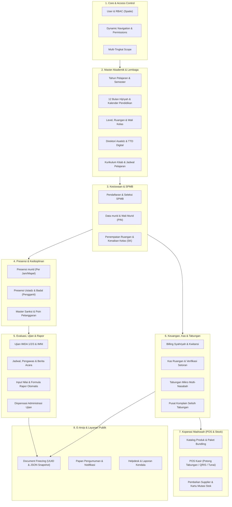

# 📄 PRODUCT REQUIREMENT DOCUMENT (PRD)

## SISTEM INFORMASI MANAJEMEN MADRASAH DINIYAH TAKMILIYAH (SIM-MDT)

**MDT Hidayatus Shibyan — Somorkoneng**

---

| Dokumen            | Informasi                                                  |
| :----------------- | :--------------------------------------------------------- |
| **Nama Proyek**    | SIM-MDT Hidayatus Shibyan                                  |
| **Versi Dokumen**  | 1.0.0 (Production Blueprint)                               |
| **Basis Analisis** | Backend Database Schema & Migrations (Laravel 11+ / MySQL) |
| **Status**         | Approved & Ready for Development                           |

---

## 1. Ringkasan Eksekutif & Gambaran Produk

**SIM-MDT Hidayatus Shibyan** adalah platform tata kelola digital terpadu (_Enterprise Madrasah Management System_) yang dirancang khusus untuk memenuhi kebutuhan operasional khas Madrasah Diniyah Takmiliyah. Sistem ini mengintegrasikan seluruh lini layanan pendidikan diniyah pesantren:

1. **Kurikulum Kitab & Kalender Dual-Sistem:** Mendukung penjadwalan mapel kitab kuning, jam pelajaran khas madrasah (_Nadzoman_, Jam 1, Jam 2, Jam Ekstra), serta penanggalan berbasis sinkronisasi Masehi dan 12 Bulan Hijriyah.
2. **Kesiswaan, Rombel & SPMB:** Manajemen murid multi-nasab (data biologis ayah/ibu), akun wali murid berbasis autentikasi PIN, alokasi kelas (_ruangan_), kenaikan kelas berbasis Surat Keputusan (SK), serta Penerimaan Murid Baru daring.
3. **Presensi Digital & Kedisiplinan:** Presensi murid per mata pelajaran, presensi asatidz dilengkapi manajemen guru pengganti (_badal_), serta buku sanksi tata tertib berbasis pembobotan poin pelanggaran.
4. **Sistem Evaluasi Bertingkat & E-Rapor:** Manajemen ujian berkala (_IMDA 1, 2, 3_ dan _IMNI_), presensi ujian, berita acara pengawas, dispensasi keuangan, serta kalkulasi otomatis rapor akhir (Bobot Nilai Murni vs Bobot Akhlaq & Kedisiplinan).
5. **Ekosistem Finansial & Kas Kelas:** Tagihan syahriyah multi-periode (bulanan Hijriyah, semester, insidental), kas ruangan murid putra/putri, serta verifikasi setoran ke bendahara madrasah.
6. **Perbankan Mikro Tabungan:** Tabungan berjangka multi-nasabah (Murid, Ustadz, Kas Kelas, Umum), perhitungan saldo $O(1)$, potongan administrasi musyawarah, riwayat buku tabungan fisik, dan pusat penyelesaian komplain (_dispute resolution_).
7. **Unit Usaha Koperasi (POS & Inventory):** Penjualan kasir terintegrasi metode _Potong Tabungan_, bundling paket kitab/seragam, penerimaan faktur distributor/supplier, pelunasan hutang dagang, dan kartu mutasi stok real-time.
8. **E-Arsip (Document Freezing):** Penguncian data historis rapor dan kwitansi menggunakan UUID dan JSON Snapshot guna mencegah manipulasi integritas data masa lalu.

---

## 2. Pengguna Sasaran & Peran (User Personas & RBAC)

Sistem menggunakan otorisasi berbasis peran dinamis (_Role-Based Access Control / Spatie Permissions_) dengan rincian pengguna:

| Peran (Role)                   | Tanggung Jawab & Cakupan Akses                                                                                                                                                                   |
| :----------------------------- | :----------------------------------------------------------------------------------------------------------------------------------------------------------------------------------------------- |
| **Super Administrator**        | Akses menyeluruh ke sistem, manajemen pengguna, izin (_permissions_), menu dinamis, struktur kepengurusan madrasah, konfigurasi tingkatan, dan pemeliharaan sistem.                              |
| **Kepala Madrasah / Pengurus** | Monitoring operasional madrasah, penetapan SK kenaikan/kelulusan murid, persetujuan dispensasi ujian, dan pengawasan laporan keuangan.                                                           |
| **Ustadz / Wali Kelas**        | Penginputan presensi murid harian, presensi ujian, penulisan berita acara ujian, pencatatan pelanggaran murid, pengelolaan kas ruangan, dan input nilai rapor.                                   |
| **Bendahara Madrasah**         | Pembuatan master tarif tagihan, penerimaan pembayaran syahriyah, verifikasi setoran kas kelas, serta pengelolaan tabungan nasabah.                                                               |
| **Pengelola Koperasi**         | Pengelolaan master barang, penetapan barcode/SKU, paket produk murid baru, operasional kasir (POS), pembelian stok supplier, dan stok opname.                                                    |
| **Wali Murid**                 | Akses portal/aplikasi mandiri berbasis PIN untuk memantau kehadiran murid, nilai rapor, tagihan syahriyah, tabungan, pengajuan komplain saldo, pendaftaran SPMB, dan pengajuan kendala/helpdesk. |

---

## 3. Arsitektur Modul Sistem



---

## 4. Spesifikasi Kebutuhan Fungsional per Modul

### 4.1. Modul 1: Autentikasi, Otorisasi (RBAC) & Tata Kelola Menu

- **Tabel Basis:** `users`, `permissions`, `roles`, `model_has_roles`, `model_has_permissions`, `role_has_permissions`, `personal_access_tokens`, `menus`, `menu_permission`, `administrators`.
- **Fitur Utama:**
  - Autentikasi aman berbasis token (_Laravel Sanctum_).
  - Pengendalian otorisasi per aksi (_create, read, update, delete, verify, publish_) menggunakan Spatie Permissions.
  - Manajemen navigasi hierarkis dinamis (`menus`) dengan pengelompokan `main_menu_id`, urutan `orders`, ikon, dan otorisasi menu per permission (`menu_permission`).
  - Pelacakan aktivitas pengguna secara berkala melalui kolom `users.last_seen`.

### 4.2. Modul 2: Master Kelembagaan, Organisasi & Kalender Hijriyah

- **Tabel Basis:** `tingkats`, `levels`, `tahun_pelajarans`, `semesters`, `bulan_hijriyahs`, `kalendar_pendidikans`, `kategori_kegiatans`, `hari_liburs`, `kampungs`, `jabatan_pengurus`, `periode_kepengurusan`, `anggota`, `pengurus`.
- **Fitur Utama:**
  - **Tingkat MDT:** Mendukung multi-tingkat (e.g. Awaliyah, Wustha, Ulya) lengkap dengan `kode_warna`, urutan, dan kode institusi.
  - **Kalender Dual-Sistem:** Pemetaan 12 Bulan Hijriyah (`bulan_hijriyahs`) ke rentang tanggal Masehi sebagai acuan akademik dan penagihan syahriyah bulanan.
  - **Agenda Pendidikan & Libur:** Manajemen kalender kegiatan berwana (`kategori_kegiatans`) serta penanggalan libur resmi madrasah (`hari_liburs`).
  - **Struktur Keorganisasian:** Pengelolaan kepengurusan madrasah terstruktur (`periode_kepengurusan`, `jabatan_pengurus`, `anggota`, `pengurus`) lengkap dengan nomor SK resmi.

### 4.3. Modul 3: Manajemen murid, Wali Murid & Penempatan Rombel

- **Tabel Basis:** `murids`, `wali_murids`, `ruangans`, `murid_ruangans`, `riwayat_kenaikans`.
- **Fitur Utama:**
  - **Profil Lengkap murid:** NISM unik, NISN, NIK, biodata pribadi, data biologis ayah dan ibu (nama, NIK, status hidup/meninggal), serta status keaktifan (`Aktif`, `Lulus`, `Pindah`, `Berhenti`).
  - **Portal Mandiri Wali Murid:** Pengelompokan murid per Kepala Keluarga (`wali_murids`), domisili kampung, deteksi wali dari kalangan ustadz (`is_ustadz`), serta sistem keamanan PIN 6-digit (`pin`, `is_pin_changed`).
  - **Rombel Kelas:** Alokasi murid ke ruangan kelas paralel per tahun ajaran, batas kapasitas, dan penunjukan ustadz wali kelas.
  - **Kenaikan Kelas & SK:** Keputusan akhir tahun (`Naik Kelas`, `Tinggal Kelas`, `Lulus`) disertai nilai akumulasi, catatan wali kelas, nomor SK resmi, dan pelacakan level tujuan (`level_tujuan_id`).

### 4.4. Modul 4: Sistem Penerimaan Murid Baru (SPMB Online)

- **Tabel Basis:** `pendaftaran_spmbs`.
- **Fitur Utama:**
  - Pendaftaran calon murid baru dengan nomor unik (`nomor_pendaftaran`).
  - Pengumpulan data identitas calon murid, wali murid, dan riwayat biologis orang tua.
  - Alur verifikasi bertingkat: `Menunggu Verifikasi`, `Diterima`, `Ditolak` beserta catatan verifikasi dan identitas verifikator (`verified_by`).
  - Konversi otomatis data pendaftaran menjadi murid resmi di tabel `murids` beserta penetapan NISM otomatis.
  - Pengelolaan biaya administrasi pendaftaran (`nominal_biaya`, `status_pembayaran`: `Belum Lunas`, `Lunas`, `Gratis`).

### 4.5. Modul 5: Kurikulum Kitab & Penjadwalan Pelajaran

- **Tabel Basis:** `mata_pelajarans`, `jadwal_pelajarans`, `ustadzs`.
- **Fitur Utama:**
  - Master mata pelajaran kitab (`Wajib` / `Ekstra`), keterkaitan dengan tingkatan level, referensi kitab kuning, pengarang (_muallif_), dan penerbit.
  - Penyusunan jadwal mingguan (Sabtu–Kamis) per ruangan kelas, pemetaan jam pelajaran (`Nadzoman`, `1`, `2`, `Ekstra`), rentang waktu, dan ustadz pengampu.
  - Profil tenaga pendidik (NIGM, NIK, kontak, tahun mulai mengajar, foto profil, dan tanda tangan digital untuk legalitas rapor).

### 4.6. Modul 6: Presensi Digital & Sistem Poin Kedisiplinan

- **Tabel Basis:** `presensi_murids`, `presensi_ustadzs`, `referensi_pelanggarans`, `pelanggaran_murids`.
- **Fitur Utama:**
  - **Presensi murid:** Pencatatan kehadiran per mata pelajaran per hari (`Hadir`, `Sakit`, `Izin`, `Alpha`, `Dispensasi`) terikat pada jadwal dan semester aktif.
  - **Presensi Ustadz & Badal:** Pencatatan kehadiran guru dan penunjukan guru pengganti (_badal_) (`ustadz_pengganti_id`) saat berhalangan hadir (`Sakit`, `Izin`, `Alpha`, `Kosong`).
  - **Buku Catatan Pelanggaran:** Master pelanggaran (`Ringan`, `Sedang`, `Berat`) dengan bobot poin penalti, pencatatan tanggal insiden, pelapor, dan akumulasi poin murid.

### 4.7. Modul 7: Evaluasi, Ujian (IMDA/IMNI) & Kalkulasi Nilai Rapor

- **Tabel Basis:** `ujians`, `jadwal_ujians`, `presensi_ujians`, `presensi_pengawas_ujians`, `nilai_ujians`, `dispensasi_ujians`, `pengaturan_akademiks`.
- **Fitur Utama:**
  - Manajemen ujian bertingkat: `IMDA 1` (Imtihan Daury 1), `IMDA 2`, `IMDA 3`, dan `IMNI` (Imtihan Niha'i / Ujian Akhir).
  - Plotting jadwal ujian, ruangan, dan penunjukan pengawas serta pengawas pengganti (_badal_).
  - Presensi kehadiran murid ujian serta presensi pengawas lengkap dengan Berita Acara Ujian digital.
  - Dispensasi administrasi keuangan ujian murid (`dispensasi_ujians`).
  - **Formula Otomatis Rapor Diniyah (`pengaturan_akademiks`):**
    $$\text{Nilai Akhir} = \left(\frac{\text{Bobot IMDA}}{100} \times \text{Nilai Ujian}\right) + \left(\frac{\text{Bobot Akhlaq}}{100} \times \text{Nilai Akhlaq}\right)$$
    $$\text{Nilai Akhlaq} = 100 - (\text{Poin Alpha} \times \text{Bobot Presensi}) - (\text{Akumulasi Poin Pelanggaran} \times \text{Bobot Pelanggaran})$$
  - Kontrol publikasi nilai ke wali murid (`is_published`).

### 4.8. Modul 8: Manajemen Keuangan & Billing Syahriyah

- **Tabel Basis:** `pengaturan_tagihans`, `tagihan_murids`, `pembayaran_tagihans`.
- **Fitur Utama:**
  - Skema tarif tagihan fleksibel: bulanan/syahriyah (per bulan Hijriyah), per semester, dan insidental.
  - Pembuatan tagihan massal otomatis ke seluruh murid aktif sesuai level/ruangan.
  - Status tagihan lengkap: `Belum Lunas`, `Lunas`, `Bebas/Gratis`, dan `Ditanggung Donatur`.
  - Kasir pembayaran dengan nomor transaksi unik, identitas penyetor, metode pembayaran, dan cetak kwitansi sah.

### 4.9. Modul 9: Kas Ruangan (Kelas) & Verifikasi Setoran

- **Tabel Basis:** `pengaturan_kas_ruangans`, `pembayaran_kas_ruangans`, `setoran_kas_ruangans`.
- **Fitur Utama:**
  - Pengaturan tarif kas kelas yang dapat dibedakan antara murid putra dan putri.
  - Pencatatan iuran kas kelas oleh wali kelas/bendahara ruangan (`is_disetor`).
  - Alur verifikasi setoran kas ruangan oleh Bendahara Umum (`Menunggu Verifikasi`, `Diterima`, `Ditolak`) yang secara otomatis terkoneksi ke transaksi tabungan ruangan (`transaksi_tabungan_id`).

### 4.10. Modul 10: Sistem Perbankan Tabungan Mikro

- **Tabel Basis:** `periode_tabungans`, `pengaturan_potongan_tabungans`, `tabungans`, `transaksi_tabungans`, `kategori_penarikans`, `riwayat_buku_tabungans`, `tabungan_komplains`.
- **Fitur Utama:**
  - **Multi-Nasabah:** Rekening unik untuk `Murid`, `Ustadz`, `Kas Ruangan`, dan `Umum`.
  - **Saldo Caching $O(1)$:** Kolom `saldo`, `total_setor`, `total_tarik`, dan `total_potongan` ter-cache dengan proteksi transaksi ACID.
  - **Tabungan Berjangka:** Pengaturan periode pembukaan, penutupan, dan pembagian saldo tabungan akhir tahun ajaran.
  - **Potongan Musyawarah:** Perhitungan otomatis biaya administrasi berdasarkan persentase kesepakatan musyawarah per kategori nasabah.
  - **Pusat Komplain Tabungan (_Dispute Resolution_):** Formulir sanggahan selisih saldo/transaksi oleh wali murid dengan bukti foto buku fisik dan verifikasi admin.

### 4.11. Modul 11: Koperasi Madrasah (POS Kasir & Inventori)

- **Tabel Basis:** `kategori_produks`, `produk_koperasis`, `paket_koperasis`, `paket_koperasi_items`, `penjualan_koperasis`, `penjualan_detail_koperasis`, `pembelian_koperasis`, `pembelian_detail_koperasis`, `mutasi_stok_koperasis`.
- **Fitur Utama:**
  - Katalog produk, kode barcode/SKU, HPP (harga beli), harga jual, batas stok minimum (_reorder point_), dan foto produk.
  - Bundling paket perlengkapan murid baru / paket kitab per tingkatan (`paket_koperasis`).
  - **Kasir Point of Sale (POS):**
    - Multi-pelanggan: Murid, Ustadz, dan Pelanggan Umum.
    - Multi-metode pembayaran: `Tunai`, `QRIS`, `Transfer`, dan **`Potong_Tabungan`** (auto-debet saldo tabungan murid).
    - Penghitungan laba kotor langsung dari selisih nilai penjualan dan HPP.
  - Pembelian barang dari distributor/supplier, pencatatan hutang dagang, dan pelunasan bertahap.
  - Kartu mutasi stok lengkap untuk melacak semua transaksi keluar-masuk, retur, dan penyesuaian opname stok.

### 4.12. Modul 12: E-Arsip Digital (_Document Freezing_)

- **Tabel Basis:** `arsip_dokumens`.
- **Fitur Utama:**
  - **Immutability Data:** Penguncian dokumen resmi cetak (Rapor, Kwitansi, Syahadah/Ijazah, SK).
  - **JSON Snapshot Data:** Menyimpan seluruh variabel saat pencetakan (nama pejabat penandatangan, tanda tangan digital, nominal, butir nilai) sehingga perubahan master data di masa depan tidak merubah keaslian arsip historis.
  - Primary key berbasis UUID v4 dan relasi polymorphic ke entitas asal.

### 4.13. Modul 13: Informasi, Pengumuman & Layanan Bantuan (Helpdesk)

- **Tabel Basis:** `pengumumans`, `notifications`, `laporan_kendalas`, `settings`.
- **Fitur Utama:**
  - Papan pengumuman madrasah (`Informasi`, `Penting`, `Kegiatan`, `Libur`) terarah ke target audiens (`Semua`, `Wali Murid`, `Ustadz`) disertai lampiran PDF.
  - Notifikasi in-app untuk pembaruan informasi akademik dan tagihan.
  - Helpdesk & pelaporan kendala teknis dari wali murid / ustadz lengkap dengan pencatatan tipe perangkat, versi aplikasi, serta alur tanggapan tim admin.

---

## 5. Kebutuhan Non-Fungsional (Non-Functional Requirements)

| Parameter                            | Spesifikasi & Standar Implementasi                                                                                                                                                                                                                                       |
| :----------------------------------- | :----------------------------------------------------------------------------------------------------------------------------------------------------------------------------------------------------------------------------------------------------------------------- |
| **Keamanan (Security)**              | • Enkripsi password menggunakan bcrypt / Argon2id.<br>• Enkripsi PIN 6-digit wali murid.<br>• Sanitasi input ketat, parameter binding untuk pencegahan SQL Injection, XSS protection, dan CSRF token.<br>• Pembatasan akses berbasis Spatie Middleware per endpoint API. |
| **Konsistensi Transaksional (ACID)** | • Seluruh transaksi mutasi tabungan, penjualan koperasi (potong tabungan), setoran kas, dan pembayaran tagihan wajib dieksekusi di dalam `DB::transaction()` dengan locking level tinggi untuk mencegah _race conditions_.                                               |
| **Performa & Skalabilitas**          | • Penambahan indeks komposit pada seluruh foreign key, nomor registrasi, dan kolom filter tanggal (`performance_indexes_to_tables`).<br>• Caching saldo tabungan secara redundan pada level baris nasabah untuk akses baca instan $O(1)$.                                |
| **Jejak Audit (Audit Trail)**        | • Setiap mutasi data krusial wajib mencatat user pelaksana (`diinput_oleh`, `diverifikasi_oleh`, `diputuskan_oleh`, `dicetak_oleh`) lengkap dengan timestamp.                                                                                                            |
| **Penyimpanan Berkas (Storage)**     | • Manajemen direktori terisolasi untuk foto murid, lampiran pengumuman PDF, arsip faktur pembelian koperasi, bukti transaksi fisik, dan berkas e-arsip.                                                                                                                  |

---

## 6. Kamus Entitas Database (Entity Dictionary)

Berikut adalah daftar tabel database yang membentuk fondasi sistem SIM-MDT:

| No  | Nama Tabel                      | Deskripsi & Fungsi Utama                                                       |
| :-: | :------------------------------ | :----------------------------------------------------------------------------- |
|  1  | `users`                         | Akun pengguna utama sistem (Admin, Ustadz, Wali Murid) & tracking `last_seen`. |
|  2  | `permissions`                   | Master daftar izin akses granular (_Spatie_).                                  |
|  3  | `roles`                         | Master peranan pengguna sistem (_Spatie_).                                     |
|  4  | `model_has_roles`               | Pemetaan peran ke pengguna.                                                    |
|  5  | `model_has_permissions`         | Pemetaan izin langsung ke pengguna.                                            |
|  6  | `role_has_permissions`          | Pemetaan izin ke peranan.                                                      |
|  7  | `personal_access_tokens`        | Token otentikasi API (_Laravel Sanctum_).                                      |
|  8  | `menus`                         | Konfigurasi menu dinamis dan hierarki navigasi.                                |
|  9  | `menu_permission`               | Hak akses visibilitas menu berbasis permission.                                |
| 10  | `administrators`                | Profil data pelengkap akun administrator.                                      |
| 11  | `tingkats`                      | Master jenjang madrasah (kode tingkat, urutan, warna, nama MDT).               |
| 12  | `levels`                        | Master tingkatan kelas (Kelas 1, 2, 3, dst.).                                  |
| 13  | `tahun_pelajarans`              | Master tahun ajaran akademik (misal: 2026/2027).                               |
| 14  | `semesters`                     | Master semester per tahun ajaran beserta status keaktifan.                     |
| 15  | `bulan_hijriyahs`               | 12 Bulan Hijriyah terpetakan ke rentang tanggal Masehi.                        |
| 16  | `kalendar_pendidikans`          | Agenda kegiatan akademik madrasah.                                             |
| 17  | `kategori_kegiatans`            | Kategori agenda kegiatan beserta kode warna tampilan.                          |
| 18  | `hari_liburs`                   | Penetapan rentang hari libur madrasah.                                         |
| 19  | `kampungs`                      | Master wilayah/kampung domisili murid dan wali murid.                          |
| 20  | `ustadzs`                       | Profil data guru/asatidz, NIK, NIGM, dan tanda tangan digital.                 |
| 21  | `ruangans`                      | Ruangan kelas paralel per tahun pelajaran & level.                             |
| 22  | `wali_murids`                   | Profil wali murid (Kepala Keluarga, no registrasi, dan PIN login).             |
| 23  | `murids`                        | Biodata lengkap murid, NISM, NISN, data biologis ayah/ibu, dan status.         |
| 24  | `murid_ruangans`                | Pemetaan rombongan belajar murid ke ruangan per tahun ajaran.                  |
| 25  | `riwayat_kenaikans`             | Riwayat keputusan kenaikan kelas, kelulusan, dan nomor SK.                     |
| 26  | `pendaftaran_spmbs`             | Formulir seleksi dan verifikasi penerimaan murid baru.                         |
| 27  | `mata_pelajarans`               | Kurikulum mata pelajaran kitab (Wajib/Ekstra) dan muallif.                     |
| 28  | `jadwal_pelajarans`             | Jadwal mingguan mata pelajaran per ruangan dan ustadz pengampu.                |
| 29  | `presensi_murids`               | Pencatatan kehadiran murid harian per jam pelajaran.                           |
| 30  | `presensi_ustadzs`              | Pencatatan kehadiran ustadz dan penunjukan guru badal (pengganti).             |
| 31  | `referensi_pelanggarans`        | Master tata tertib dan bobot poin sanksi pelanggaran.                          |
| 32  | `pelanggaran_murids`            | Catatan insiden pelanggaran murid harian.                                      |
| 33  | `jabatan_pengurus`              | Master struktur jabatan kepengurusan lembaga.                                  |
| 34  | `periode_kepengurusan`          | Masa bakti kepengurusan madrasah.                                              |
| 35  | `anggota`                       | Biodata personil kepengurusan (terkoneksi ke ustadz).                          |
| 36  | `pengurus`                      | Penugasan jabatan kepengurusan per periode dan nomor SK.                       |
| 37  | `ujians`                        | Master agenda ujian (IMDA 1/2/3, IMNI) per semester.                           |
| 38  | `jadwal_ujians`                 | Jadwal sesi ujian per mata pelajaran, level, dan pengawas.                     |
| 39  | `presensi_ujians`               | Kehadiran murid pada setiap sesi ujian.                                        |
| 40  | `presensi_pengawas_ujians`      | Presensi pengawas ujian dan pencatatan Berita Acara Ujian.                     |
| 41  | `nilai_ujians`                  | Nilai hasil ujian murid per mata pelajaran.                                    |
| 42  | `dispensasi_ujians`             | Izin dispensasi administrasi keuangan bagi murid saat ujian.                   |
| 43  | `pengaturan_akademiks`          | Konfigurasi formula bobot nilai rapor dan poin akhlaq.                         |
| 44  | `pengaturan_tagihans`           | Master tarif tagihan (bulanan Hijriyah, semester, insidental).                 |
| 45  | `tagihan_murids`                | Rekening tagihan per murid per periode penagihan.                              |
| 46  | `pembayaran_tagihans`           | Transaksi pembayaran tagihan dan kwitansi.                                     |
| 47  | `pengaturan_kas_ruangans`       | Tarif iuran kas ruangan per gender (murid putra/putri).                        |
| 48  | `pembayaran_kas_ruangans`       | Penerimaan iuran kas kelas dari murid.                                         |
| 49  | `setoran_kas_ruangans`          | Penyerahan dan verifikasi setoran kas kelas ke bendahara umum.                 |
| 50  | `periode_tabungans`             | Periode program tabungan berjangka murid.                                      |
| 51  | `pengaturan_potongan_tabungans` | Master persentase potongan administrasi tabungan hasil musyawarah.             |
| 52  | `tabungans`                     | Rekening tabungan nasabah (Murid, Ustadz, Kas, Umum) & cache saldo.            |
| 53  | `transaksi_tabungans`           | Jurnal mutasi debit/kredit rekening tabungan.                                  |
| 54  | `kategori_penarikans`           | Master peruntukan penarikan dana tabungan.                                     |
| 55  | `riwayat_buku_tabungans`        | Log riwayat fisik buku tabungan nasabah.                                       |
| 56  | `tabungan_komplains`            | Pelaporan komplain selisih saldo tabungan & upload bukti fisik.                |
| 57  | `kategori_produks`              | Kategori etalase barang usaha koperasi.                                        |
| 58  | `produk_koperasis`              | Master produk koperasi (barcode/SKU, HPP, harga jual, stok).                   |
| 59  | `paket_koperasis`               | Paket bundling produk murid (seragam, paket kitab).                            |
| 60  | `paket_koperasi_items`          | Rincian item barang di dalam paket bundling.                                   |
| 61  | `penjualan_koperasis`           | Faktur transaksi kasir POS penjualan koperasi.                                 |
| 62  | `penjualan_detail_koperasis`    | Rincian barang belanjaan per transaksi kasir.                                  |
| 63  | `pembelian_koperasis`           | Faktur pembelian stok dari supplier dan pelunasan hutang.                      |
| 64  | `pembelian_detail_koperasis`    | Rincian barang masuk per faktur pembelian.                                     |
| 65  | `mutasi_stok_koperasis`         | Log audit kartu pergerakan stok inventori koperasi.                            |
| 66  | `arsip_dokumens`                | Pembekuan dokumen cetak resmi (UUID, PDF, JSON snapshot).                      |
| 67  | `pengumumans`                   | Papan maklumat/berita resmi madrasah dan lampiran PDF.                         |
| 68  | `notifications`                 | Notifikasi in-app real-time untuk pengguna.                                    |
| 69  | `laporan_kendalas`              | Helpdesk dan kanal penanganan kendala pengguna.                                |
| 70  | `settings`                      | Konfigurasi parameter global aplikasi.                                         |

---

## 7. Rencana Rilis & Prioritas Pengembangan (Milestones)

```
┌─────────────────────────────────────────────────────────────────────────────┐
│ FASE 1: PONDASI CORE, DATA LEMBAGA & AKADEMIK                               │
│ ├─ User Management, Role & Permission (Spatie), Dynamic Navigation Menus   │
│ ├─ Master Lembaga, Tingkat, Tahun Ajaran, Semester & 12 Bulan Hijriyah      │
│ ├─ Master Asatidz (TTD Digital), murid (Nasab Biologis), Wali Murid (PIN)  │
│ └─ Kurikulum Kitab Kuning, Jadwal Mingguan, Presensi murid & Guru Badal    │
├─────────────────────────────────────────────────────────────────────────────┤
│ FASE 2: KEDISIPLINAN, EVALUASI UJIAN & E-RAPOR                              │
│ ├─ Buku Tata Tertib & Pencatatan Poin Pelanggaran murid                    │
│ ├─ Ujian IMDA 1/2/3 & IMNI, Presensi Ujian, Berita Acara Pengawas           │
│ ├─ Dispensasi Keuangan Ujian & Formula Otomatis Rapor Diniyah               │
│ └─ E-Arsip Digital (Document Freezing dengan UUID & JSON Snapshot)          │
├─────────────────────────────────────────────────────────────────────────────┤
│ FASE 3: KEUANGAN MADRASAH, KAS KELAS & TABUNGAN MIKRO                       │
│ ├─ Billing Syahriyah Hijriyah, Kwitansi Pembayaran & Status Donatur         │
│ ├─ Kas Ruangan Putra/Putri & Verifikasi Setoran ke Bendahara                │
│ ├─ Tabungan Multi-Nasabah, Potongan Musyawarah & Cache Saldo O(1)           │
│ └─ Pusat Komplain & Resolusi Selisih Tabungan                               │
├─────────────────────────────────────────────────────────────────────────────┤
│ FASE 4: KOPERASI (POS & STOK), SPMB ONLINE & LAYANAN PUBLIK                 │
│ ├─ Master Produk Barcode/SKU, Paket Bundling & Kartu Mutasi Stok            │
│ ├─ POS Kasir (Potong Tabungan, QRIS, Tunai) & Pembelian Supplier            │
│ ├─ Portal SPMB Online & Konversi Otomatis ke NISM murid                    │
│ └─ Papan Pengumuman Digital, Notifikasi In-App & Helpdesk Kendala           │
└─────────────────────────────────────────────────────────────────────────────┘
```
