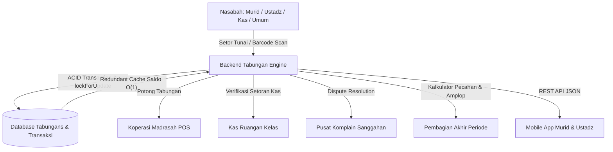
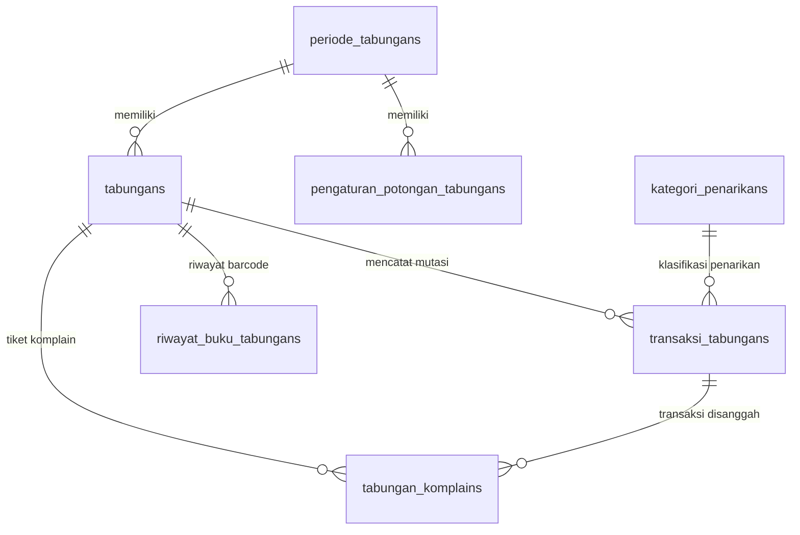
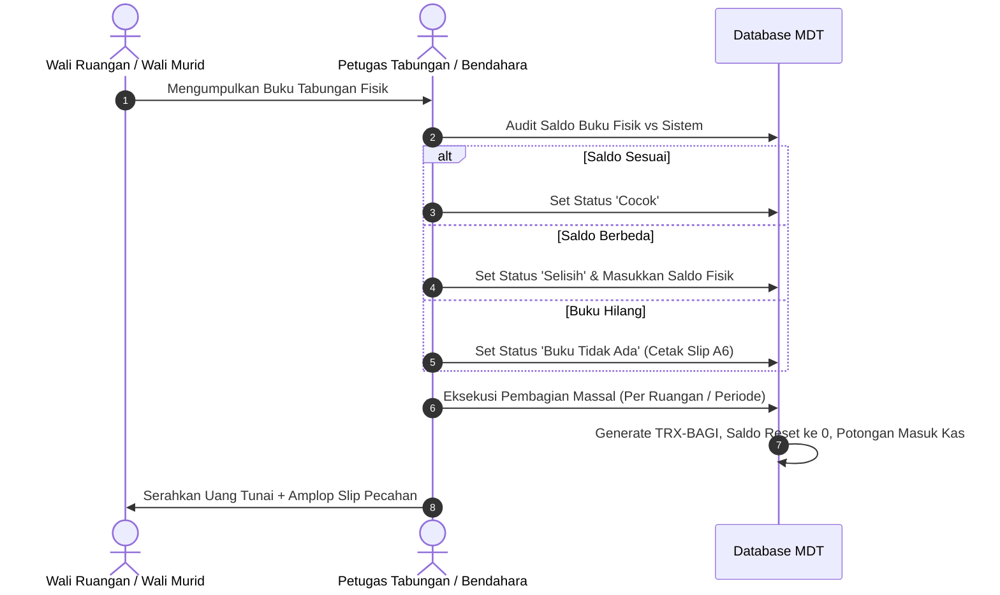

# 🏦 MDT HIDAYATUS SHIBYAN - MASTER BLUEPRINT SISTEM TABUNGAN MADRASAH

> **Dokumen Tunggal Kebijakan, Arsitektur Sistem, Logika Keuangan, dan Panduan Operasional Tabungan Mikro Multi-Nasabah**  
> _Versi 2.0 — Terakhir Diperbarui: September 2026_  
> _Status: Single Source of Truth (SSOT) Modul Tabungan Madrasah_

---

## 📑 DAFTAR ISI

1. [Ringkasan Eksekutif & Filosofi Sistem](#-1-ringkasan-eksekutif--filosofi-sistem)
2. [Arsitektur & Skema Basis Data (Database Schema)](#-2-arsitektur--skema-basis-data-database-schema)
3. [Format Penomoran Rekening & Sistem Barcode](#-3-format-penomoran-rekening--sistem-barcode)
4. [Logika Bisnis Keuangan & Rumus Matematis](#-4-logika-bisnis-keuangan--rumus-matematis)
5. [Spesifikasi Fitur & Alur Kerja Web Admin](#-5-spesifikasi-fitur--alur-kerja-web-admin)
   - 5.1. Dashboard Tabungan Madrasah
   - 5.2. Master Rekening & Pendaftaran Buku Baru
   - 5.3. Penggantian Buku Tabungan Fisik (Dispute-Proof)
   - 5.4. Operasional Transaksi Setor Tunai
   - 5.5. Operasional Transaksi Tarik Tunai
   - 5.6. Konfigurasi Periode, Potongan Musyawarah & Kategori Penarikan
   - 5.7. Verifikasi Buku Fisik & Pembagian Akhir Periode
   - 5.8. Kalkulator & Rekapitulasi Denominasi Uang Pecahan Kas Fisik
   - 5.9. Cek Mutasi, Audit & Lembar Pengganti A6
   - 5.10. Pusat Komplain & Resolusi Sanggahan Saldo (Dispute Resolution)
6. [Integrasi Lintas Modul (Cross-Module Ecosystem)](#-6-integrasi-lintas-modul-cross-module-ecosystem)
   - 6.1. Integrasi Kas Ruangan (Auto-Lock / Unlock Cicilan Kas)
   - 6.2. Integrasi Koperasi Madrasah (POS Kasir - Potong Tabungan)
   - 6.3. Integrasi Aplikasi Mobile Murid (`app_murid`)
   - 6.4. Integrasi Aplikasi Mobile Ustadz (`app_ustadz`)
7. [Daftar Rute Web & REST API Endpoints](#-7-daftar-rute-web--rest-api-endpoints)
8. [Matriks Hak Akses & Keamanan (RBAC)](#-8-matriks-hak-akses--keamanan-rbac)
9. [Standar Operasional Prosedur (SOP) & Troubleshooting](#-9-standar-operasional-prosedur-sop--troubleshooting)

---

## 🌟 1. RINGKASAN EKSEKUTIF & FILOSOFI SISTEM

Modul **Tabungan Madrasah** di Madrasah Diniyah Takmiliyah (MDT) Hidayatus Shibyan dirancang sebagai sistem perbankan mikro terpadu yang aman, transparan, dan akuntabel berbasis syariah. Sistem ini mengelola dana simpanan multi-nasabah (Murid, Ustadz, Kas Ruangan, dan Umum/Donatur) dengan masa siklus berjangka tahunan maupun tabungan bebas.



### Prinsip Utama Sistem:

1. **Multi-Nasabah Terisolasi:** Mendukung 4 entitas nasabah (`Murid`, `Ustadz`, `Kas Ruangan`, `Umum`) dalam satu buku besar dengan aturan potongan yang fleksibel per entitas.
2. **Kecepatan Akses $O(1)$ dengan Integritas ACID:** Menggunakan pencatatan ganda—saldo berjalan dihitung pada setiap mutasi dan di-cache langsung pada level record tabel `tabungans` untuk pembacaan instan tanpa query agregasi berat berulang.
3. **Pemberian Uang Utuh di Penarikan:** Penarikan sebelum akhir periode tidak dipotong di depan; sistem secara cerdas mengunci saldo cadangan potongan musyawarah madrasah agar dana operasional lembaga tetap terlindungi.
4. **Dispute-Proof & Jejak Audit Lengkap:** Setiap pergantian buku hilang/rusak, perubahan nominal setoran, dan penanganan komplain saldo wali murid memiliki riwayat mutasi dan verifikator yang tercatat permanen.

---

## 🗄️ 2. ARSITEKTUR & SKEMA BASIS DATA (DATABASE SCHEMA)

Sistem Tabungan Madrasah didukung oleh 7 tabel utama di basis data MySQL/MariaDB:



### 2.1. Tabel `tabungans` (Master Rekening & Cache Saldo)

Menyimpan identitas rekening buku tabungan dan cache saldo redundan.

| Kolom                 | Tipe Data                                                       | Keterangan                                             |
| :-------------------- | :-------------------------------------------------------------- | :----------------------------------------------------- |
| `id`                  | `BIGINT UNSIGNED (PK)`                                          | Auto-increment primary key.                            |
| `nomor_rekening`      | `VARCHAR(50) (UNIQUE)`                                          | Nomor barcode buku fisik (7-digit seri atau custom).   |
| `nama_rekening`       | `VARCHAR(100)`                                                  | Label rekening (default: "Tabungan Utama").            |
| `jenis_nasabah`       | `ENUM('Murid','Ustadz','Kas Ruangan','Umum')`                   | Klasifikasi entitas pemilik tabungan.                  |
| `murid_id`            | `BIGINT UNSIGNED (FK, Nullable)`                                | Relasi ke `murids.id` jika jenis = Murid.              |
| `ustadz_id`           | `BIGINT UNSIGNED (FK, Nullable)`                                | Relasi ke `ustadzs.id` jika jenis = Ustadz.            |
| `ruangan_id`          | `BIGINT UNSIGNED (FK, Nullable)`                                | Relasi ke `ruangans.id` jika jenis = Kas Ruangan.      |
| `nama_nasabah_umum`   | `VARCHAR(150) (Nullable)`                                       | Nama perseorangan jika jenis = Umum.                   |
| `kontak_umum`         | `VARCHAR(30) (Nullable)`                                        | Nomor HP / WhatsApp nasabah umum.                      |
| `alamat_umum`         | `VARCHAR(255) (Nullable)`                                       | Alamat domisili nasabah umum.                          |
| `periode_tabungan_id` | `BIGINT UNSIGNED (FK, Nullable)`                                | Relasi ke `periode_tabungans.id`.                      |
| `saldo`               | `DECIMAL(14,2)`                                                 | **Cache Saldo Berjalan $O(1)$** saat ini.              |
| `total_setor`         | `DECIMAL(14,2)`                                                 | Akumulasi seluruh setoran masuk.                       |
| `total_tarik`         | `DECIMAL(14,2)`                                                 | Akumulasi seluruh penarikan keluar.                    |
| `total_potongan`      | `DECIMAL(14,2)`                                                 | Akumulasi potongan administrasi yang telah dieksekusi. |
| `buku_tabungan_ada`   | `BOOLEAN (Default: 1)`                                          | Status keberadaan fisik buku saat verifikasi akhir.    |
| `status_verifikasi`   | `ENUM('Belum Diverifikasi','Cocok','Selisih','Buku Tidak Ada')` | Status pencocokan buku fisik akhir tahun.              |
| `saldo_buku_fisik`    | `DECIMAL(14,2) (Nullable)`                                      | Saldo yang tertulis di buku cetak fisik saat diaudit.  |
| `catatan_verifikasi`  | `TEXT (Nullable)`                                               | Catatan tim verifikator tabungan.                      |
| `diverifikasi_oleh`   | `BIGINT UNSIGNED (FK, Nullable)`                                | User ID petugas verifikasi.                            |
| `diverifikasi_pada`   | `DATETIME (Nullable)`                                           | Timestamp verifikasi.                                  |
| `status`              | `ENUM('Aktif','Nonaktif','Dibagikan','Ditutup')`                | Status operasional rekening.                           |
| `catatan`             | `TEXT (Nullable)`                                               | Catatan khusus pembukaan rekening.                     |
| `dibuat_oleh`         | `BIGINT UNSIGNED (FK, Nullable)`                                | User ID pembuka rekening.                              |

---

### 2.2. Tabel `transaksi_tabungans` (Jurnal Mutasi Transaksi)

Menyimpan seluruh histori debit/kredit dengan snapshot saldo awal dan akhir.

| Kolom                   | Tipe Data                                           | Keterangan                                             |
| :---------------------- | :-------------------------------------------------- | :----------------------------------------------------- |
| `id`                    | `BIGINT UNSIGNED (PK)`                              | Primary Key.                                           |
| `kode_transaksi`        | `VARCHAR(50) (UNIQUE)`                              | Kode unik (contoh: `TRX-IN-20260910-A1B2C`).           |
| `tabungan_id`           | `BIGINT UNSIGNED (FK)`                              | Relasi ke `tabungans.id`.                              |
| `kategori_penarikan_id` | `BIGINT UNSIGNED (FK, Nullable)`                    | Relasi ke `kategori_penarikans.id` jika jenis = Tarik. |
| `jenis_transaksi`       | `ENUM('Setor','Tarik','Pembagian_Akhir','Koreksi')` | Arah mutasi arus kas.                                  |
| `nominal_kotor`         | `DECIMAL(14,2)`                                     | Nilai transaksi sebelum potongan.                      |
| `persentase_potongan`   | `DECIMAL(5,2)`                                      | Persentase potongan yang dikenakan (jika ada).         |
| `nominal_potongan`      | `DECIMAL(14,2)`                                     | Nominal potongan yang dipotong dari transaksi.         |
| `nominal_bersih`        | `DECIMAL(14,2)`                                     | Nominal kas aktual yang masuk/keluar.                  |
| `saldo_awal`            | `DECIMAL(14,2)`                                     | Snapshot saldo sebelum transaksi dieksekusi.           |
| `saldo_akhir`           | `DECIMAL(14,2)`                                     | Snapshot saldo setelah transaksi dieksekusi.           |
| `tanggal`               | `DATE`                                              | Tanggal efektif transaksi.                             |
| `ruangan_id`            | `BIGINT UNSIGNED (FK, Nullable)`                    | Snapshot ruangan murid saat transaksi terjadi.         |
| `petugas_id`            | `BIGINT UNSIGNED (FK, Nullable)`                    | User ID operator / bendahara yang bertugas.            |
| `metode`                | `ENUM('Tunai','Transfer','QRIS','Potong_Tabungan')` | Kanal pembayaran.                                      |
| `keterangan`            | `VARCHAR(255) (Nullable)`                           | Catatan / berita acara mutasi.                         |

---

### 2.3. Tabel `periode_tabungans` (Master Periode Berjangka)

Mengatur siklus pembukaan, penutupan, dan pembagian tabungan per tahun pelajaran.

| Kolom                | Tipe Data              | Keterangan                                         |
| :------------------- | :--------------------- | :------------------------------------------------- |
| `id`                 | `BIGINT UNSIGNED (PK)` | Primary Key.                                       |
| `tahun_pelajaran_id` | `BIGINT UNSIGNED (FK)` | Relasi ke `tahun_pelajarans.id`.                   |
| `nama_periode`       | `VARCHAR(100)`         | Contoh: "Tabungan Berjangka 2026/2027".            |
| `tanggal_mulai`      | `DATE`                 | Tanggal dibukanya setoran.                         |
| `tanggal_penutupan`  | `DATE`                 | Batas akhir setoran sebelum pembagian.             |
| `tanggal_pembagian`  | `DATE (Nullable)`      | Tanggal pelaksanaan pembagian fisik uang tabungan. |
| `is_active`          | `BOOLEAN (Default: 0)` | Flag periode aktif operasional.                    |
| `keterangan`         | `TEXT (Nullable)`      | Deskripsi atau pengumuman periode.                 |

---

### 2.4. Tabel `pengaturan_potongan_tabungans` (Tarif Potongan Musyawarah)

Konfigurasi persentase infaq/administrasi hasil musyawarah wali murid per periode.

| Kolom                 | Tipe Data                                     | Keterangan                                                               |
| :-------------------- | :-------------------------------------------- | :----------------------------------------------------------------------- |
| `id`                  | `BIGINT UNSIGNED (PK)`                        | Primary Key.                                                             |
| `periode_tabungan_id` | `BIGINT UNSIGNED (FK, Nullable)`              | Relasi ke `periode_tabungans.id` (Null = Global).                        |
| `jenis_nasabah`       | `ENUM('Murid','Ustadz','Kas Ruangan','Umum')` | Target nasabah yang dikenakan potongan.                                  |
| `persentase_potongan` | `DECIMAL(5,2)`                                | Persentase potongan (Default: Murid=10%, Ustadz=2.5%, Kas=0%, Umum=10%). |
| `dasar_musyawarah`    | `VARCHAR(255) (Nullable)`                     | Rujukan SK / Berita Acara Musyawarah Wali Murid.                         |
| `diubah_oleh`         | `BIGINT UNSIGNED (FK, Nullable)`              | User ID administrator yang memperbarui tarif.                            |

---

### 2.5. Tabel `riwayat_buku_tabungans` (Log Pergantian Buku Fisik)

Menyimpan histori pergantian barcode fisik saat buku tabungan hilang, rusak, atau penuh.

| Kolom                 | Tipe Data                                                    | Keterangan                                      |
| :-------------------- | :----------------------------------------------------------- | :---------------------------------------------- |
| `id`                  | `BIGINT UNSIGNED (PK)`                                       | Primary Key.                                    |
| `tabungan_id`         | `BIGINT UNSIGNED (FK)`                                       | Relasi ke `tabungans.id`.                       |
| `nomor_rekening_lama` | `VARCHAR(50)`                                                | Barcode buku lama sebelum diganti.              |
| `nomor_rekening_baru` | `VARCHAR(50)`                                                | Barcode buku fisik baru.                        |
| `alasan`              | `ENUM('Buku Hilang','Buku Rusak','Halaman Penuh','Lainnya')` | Alasan penggantian buku.                        |
| `saldo_terakhir`      | `DECIMAL(14,2)`                                              | Saldo terakhir saat penggantian buku dilakukan. |
| `catatan`             | `VARCHAR(255) (Nullable)`                                    | Catatan tambahan petugas.                       |
| `petugas_id`          | `BIGINT UNSIGNED (FK, Nullable)`                             | User ID petugas yang mengeksekusi.              |

---

### 2.6. Tabel `tabungan_komplains` (Pusat Resolusi Komplain / Dispute)

Pelaporan selisih saldo transaksi oleh wali murid via aplikasi mobile beserta bukti fisik.

| Kolom                   | Tipe Data                                           | Keterangan                                          |
| :---------------------- | :-------------------------------------------------- | :-------------------------------------------------- |
| `id`                    | `BIGINT UNSIGNED (PK)`                              | Primary Key.                                        |
| `kode_komplain`         | `VARCHAR(50) (UNIQUE)`                              | Format: `KMP-YYYYMMDD-XXXX`.                        |
| `tabungan_id`           | `BIGINT UNSIGNED (FK)`                              | Relasi ke `tabungans.id`.                           |
| `transaksi_tabungan_id` | `BIGINT UNSIGNED (FK)`                              | Relasi ke transaksi yang disanggah.                 |
| `murid_id`              | `BIGINT UNSIGNED (FK)`                              | Relasi ke `murids.id`.                              |
| `wali_id`               | `BIGINT UNSIGNED (FK)`                              | User ID wali murid pelapor.                         |
| `nominal_tercatat`      | `DECIMAL(14,2)`                                     | Nominal yang tercatat salah di sistem.              |
| `nominal_klaim`         | `DECIMAL(14,2)`                                     | Nominal yang diklaim sebenarnya oleh wali.          |
| `selisih`               | `DECIMAL(14,2)`                                     | Selisih nilai (`nominal_klaim - nominal_tercatat`). |
| `alasan_komplain`       | `TEXT`                                              | Penjelasan komplain dari wali murid.                |
| `foto_bukti_buku`       | `VARCHAR(255)`                                      | Path file foto buku tabungan / struk setoran.       |
| `status`                | `ENUM('Menunggu_Verifikasi','Disetujui','Ditolak')` | Status proses investigasi.                          |
| `catatan_verifikasi`    | `TEXT (Nullable)`                                   | Keterangan persetujuan/penolakan oleh bendahara.    |
| `diverifikasi_oleh`     | `BIGINT UNSIGNED (FK, Nullable)`                    | User ID bendahara verifikator.                      |
| `diverifikasi_pada`     | `DATETIME (Nullable)`                               | Waktu verifikasi dieksekusi.                        |

---

### 2.7. Tabel `kategori_penarikans` (Master Peruntukan Penarikan)

Master data klasifikasi alasan penarikan tabungan (misal: Biaya Ujian, Beli Kitab, Sakit, Kebutuhan Mendesak).

| Kolom           | Tipe Data                 | Keterangan                         |
| :-------------- | :------------------------ | :--------------------------------- |
| `id`            | `BIGINT UNSIGNED (PK)`    | Primary Key.                       |
| `nama_kategori` | `VARCHAR(100)`            | Label kategori peruntukan.         |
| `deskripsi`     | `VARCHAR(255) (Nullable)` | Keterangan detail penggunaan dana. |
| `is_active`     | `BOOLEAN (Default: 1)`    | Status aktif opsi.                 |
| `urutan`        | `INT (Default: 0)`        | Urutan penampilan di dropdown.     |

---

## 🏷️ 3. FORMAT PENOMORAN REKENING & SISTEM BARCODE

Sistem mengadopsi standarisasi penomoran rekening berbasis barcode universal agar pemindaian (barcode scanner USB / kamera HP) berjalan instan:

```text
Format Universal Barcode: [PPPP][UUU] (Total 7 Digit Numerik)
Contoh: 1000001 s.d. 1000500
├─ [1000] : 4 Digit Prefix Nomor Seri Percetakan Buku Tabungan
└─ [001]  : 3 Digit Nomor Urut Buku Fisik (001 s.d. 500)
```

### 3.1. Mekanisme Pencarian Cepat (Smart Matcher)

Operator kasir/bendahara di lapangan dapat menemukan rekening melalui 4 metode input pada kotak scanner:

1. **Full Barcode Scan:** Memindai 7 digit barcode pada sampul buku (contoh: `1000025`).
2. **Short-Number Typing (3 Digit Akhir):** Cukup ketik `25` atau `025`, sistem otomatis menggabungkan dengan prefix aktif `1000` ➔ `1000025`.
3. **NISM / NIGM Lookup:** Masukkan NISM murid (contoh: `2024001`) atau NIGM ustadz.
4. **Auto-Complete Live Name:** Pencarian nama murid/ustadz dengan respon JSON AJAX real-time.

### 3.2. Generator & Ekspor CSV Barcode Cetak

Fitur bawaan di `/tabungan/barcode/generator` memungkinkan bendahara mencetak lembaran nomor barcode sebelum tahun ajaran baru dimulai:

- Generate 500 s.d. 1000 nomor seri barcode siap cetak.
- Ekspor ke format `.csv` untuk diimpor langsung ke mesin cetak barcode label stiker buku fisik.
- Indikator status database real-time: `Tersedia` vs `Sudah Terdaftar`.

---

## 📐 4. LOGIKA BISNIS KEUANGAN & RUMUS MATEMATIS

### 4.1. Formula Potongan Administrasi Musyawarah Madrasah

Potongan tabungan adalah kesepakatan infaq musyawarah wali murid untuk pemeliharaan fasilitas madrasah, dihitung secara adil dari total akumulasi simpanan:

$$\text{RawPotongan} = \frac{\text{Total Setoran} \times \text{Persentase Potongan}}{100}$$

$$\text{Nominal Potongan} = \left\lceil \frac{\text{RawPotongan}}{100} \right\rceil \times 100 \quad (\text{Dibulatkan ke atas ke kelipatan Rp 100})$$

$$\text{Saldo Bersih Total} = \max(0, \text{Total Setoran} - \text{Nominal Potongan})$$

### 4.2. Formula Batas Penarikan Maksimal Tunai (Safe-Withdrawal Limit)

Untuk memastikan madrasah tidak mengalami defisit saat nasabah menarik tabungan di tengah tahun berjalan:

$$\text{Batas Maksimal Tarik} = \min\Big(\max\big(0, (\text{Total Setoran} - \text{Nominal Potongan}) - \text{Total Sudah Ditarik}\big), \text{Saldo Kas Saat Ini}\Big)$$

> [!IMPORTANT]
> **Kebijakan Penyerahan Uang:** Uang penarikan diserahkan **100% utuh tanpa potongan di loket**. Nominal potongan diproteksi secara otomatis di sistem sebagai saldo mengendap sampai pembagian akhir periode dilaksanakan.

### 4.3. Konsistensi Transaksional & Rekalibrasi Kronologis

Setiap aksi debit/kredit dieksekusi dengan protokol `DB::transaction()` dan locking `lockForUpdate()`:

```php
// Protokol Atomik Transaksi Tabungan
return DB::transaction(function () use ($tabunganId, $nominal, $petugasId) {
    $tabungan = Tabungan::where('id', $tabunganId)->lockForUpdate()->firstOrFail();

    // 1. Validasi Batas Penarikan / Setoran
    // 2. Insert TransaksiTabungan (Snapshot Saldo Awal & Saldo Akhir)
    // 3. Update Redundant Cache Saldo pada tabel Tabungan
});
```

Jika terjadi koreksi atau penghapusan transaksi lampau, fungsi `recalibrasiSaldoRekening($tabunganId)` dijalankan secara otomatis untuk menghitung ulang seluruh saldo berjalan transaksi secara kronologis dari tanggal terlama ke terbaru.

---

## 🖥️ 5. SPESIFIKASI FITUR & ALUR KERJA WEB ADMIN

### 5.1. Dashboard Tabungan Madrasah (`/tabungan`)

- **Metric Cards:** Total Saldo Keseluruhan, Total Akumulasi Setor, Total Penarikan, Total Potongan Madrasah.
- **Segmentasi Saldo Nasabah:** Rekap saldo per kelompok (Murid, Ustadz, Kas Ruangan, Umum).
- **Aktivitas Hari Ini:** Total setoran & penarikan harian, counter tiket komplain pending.
- **Tabel 10 Transaksi Terkini:** Live stream mutasi kas tabungan.
- **Top 5 Rekening:** Peringkat nasabah dengan saldo tabungan terbesar.

---

### 5.2. Master Rekening & Pendaftaran Buku Baru (`/tabungan/rekening/create`)

1. Pilih **Jenis Nasabah** (`Murid`, `Ustadz`, `Kas Ruangan`, `Umum`).
2. Gunakan **Live AJAX Search** untuk memanggil data murid berdasarkan NISM/Nama (otomatis mendeteksi ruangan/kelas aktif).
3. Pindai **Nomor Rekening / Barcode Buku Fisik** (atau gunakan auto-generator jika belum ber-barcode).
4. Masukkan **Setoran Awal** (opsional) ➔ sistem otomatis menerbitkan transaksi setor pertama kali.
5. Tombol shortcut cetak halaman identitas buku tabungan.

---

### 5.3. Penggantian Buku Tabungan Fisik (`/tabungan/rekening/{id}/ganti-buku`)

Ketika murid kehilangan buku fisik, buku rusak terendam, atau seluruh lembar mutasi telah penuh:

1. Operator membuka detail rekening nasabah.
2. Klik tombol **Ganti Buku Tabungan Fisik** (Modal AJAX).
3. Pindai barcode buku fisik baru.
4. Pilih alasan (`Buku Hilang`, `Buku Rusak`, `Halaman Penuh`, `Lainnya`).
5. Sistem memvalidasi keunikan barcode baru, memindahkan nomor rekening aktif ke barcode baru, dan mencatat histori lengkap ke tabel `riwayat_buku_tabungans`.
6. **Seluruh saldo dan riwayat mutasi masa lalu tetap utuh 100%.**

---

### 5.4. Operasional Transaksi Setor Tunai (`/tabungan/setor`)

1. **Pindai Barcode / Ketik 3 Digit:** Masukkan nomor buku tabungan di kolom scanner.
2. Sistem menampilkan pop-up/preview detail profil murid, kelas, saldo terkini, dan total tabungan.
3. Masukkan **Nominal Setoran** (Minimal Rp 1.000).
4. Klik **Simpan Setoran** (Shortcut keyboard `Enter`).
5. Transaksi berhasil dicatat (`TRX-IN-...`), struk/buku siap dicap.
6. **Verifikasi Kas Ruangan:** Terdapat panel terpadu untuk menyetujui setoran kas kelas yang diajukan oleh wali ruangan secara langsung menjadi transaksi tabungan kas.

---

### 5.5. Operasional Transaksi Tarik Tunai (`/tabungan/tarik`)

1. Pindai barcode rekening.
2. Sistem menghitung secara otomatis **Saldo Bersih Maksimal yang Dapat Ditarik** (setelah mencadangkan alokasi potongan madrasah).
3. Pilih **Kategori Penarikan** (misal: Biaya Rapor, Sakit, Kebutuhan Pribadi).
4. Masukkan **Nominal Penarikan**. Jika nominal melebihi batas aman, sistem menolak transaksi dan memberikan pesan informatif nominal maksimal yang diizinkan.
5. Klik **Proses Penarikan Tunai**.
6. Mendukung edit dan pembatalan transaksi penarikan jika terjadi salah input kasir.

---

### 5.6. Konfigurasi Potongan, Periode & Kategori (`/tabungan/pengaturan`)

- **Tabel Persentase Potongan:** Atur tarif potongan musyawarah untuk Murid (default 10%), Ustadz (2.5%), Kas Ruangan (0%), dan Umum (10%).
- **Manajemen Periode Berjangka:** Tambah, buka/tutup periode tabungan, dan tentukan tanggal resmi pembagian fisik.
- **Master Kategori Penarikan:** Kelola opsi dropdown alasan penarikan dana.

---

### 5.7. Verifikasi Buku Fisik & Pembagian Akhir Periode (`/tabungan/pembagian`)



1. **Simulasi Pembagian:** Filter berdasarkan Periode, Jenis Nasabah, dan Ruangan. Menampilkan rekapitulasi: Total Saldo Kotor, Total Potongan Madrasah, Total Bersih yang Diterima.
2. **Audit Verifikasi Buku Fisik:**
   - Opsi _Cocok_ (Buku fisik sesuai catatan sistem).
   - Opsi _Selisih_ (Mencatat perbedaan angka untuk diinvestigasi).
   - Opsi _Buku Tidak Ada_ (Buku fisik hilang; sistem mencetak slip lembar mutasi A6).
   - Tombol instan _Verifikasi Semua Cocok_ untuk verifikasi massal 1 kelas.
3. **Eksekusi Pembagian Massal:** Mengunci rekening, menerbitkan transaksi `Pembagian_Akhir`, mencatat potongan ke kas madrasah, dan mereset saldo rekening menjadi Rp 0 dengan status `Dibagikan`.
4. **Cetak Laporan Pembagian:** Dokumen resmi tanda terima pembagian tabungan bertanda tangan kepala madrasah dan bendahara.

---

### 5.8. Kalkulator & Rekapitulasi Uang Pecahan Fisik (`/tabungan/pecahan`)

Untuk mempermudah bendahara mengambil uang tunai di bank dan memasukkan uang ke dalam amplop masing-masing murid:

- **Algoritma Greedy Denominasi Kas:** Menghitung kombinasi lembar/koin uang secara otomatis:
  - Lembar: Rp 100.000, Rp 50.000, Rp 20.000, Rp 10.000, Rp 5.000, Rp 2.000, Rp 1.000.
  - Koin: Rp 500, Rp 200, Rp 100.
- **Rekap Global Penarikan Bank:** Menampilkan total lembar yang harus dicairkan di bank per pecahan (contoh: 245 lembar Rp 50.000, 112 lembar Rp 20.000, dst).
- **Cetak Slip Amplop Pembagian:**
  - Cetak slip individual per murid berukuran saku.
  - **Cetak Slip Massal 1 Ruangan:** Mencetak seluruh slip amplop murid dalam 1 lembar hemat kertas (grid layout) siap tempel di amplop cokelat.

---

### 5.9. Cek Mutasi, Audit & Lembar Pengganti A6 (`/tabungan/cek-mutasi`)

- **Pencarian Mutasi Cepat:** Pindai barcode untuk melihat rekap buku kas secara kronologis.
- **Rekap Bulanan:** Rangkuman total setoran, penarikan, dan saldo akhir per bulan Masehi.
- **Cetak Buku Tabungan:** Format cetak pas-buku tabungan standar perbankan.
- **Cetak Lembaran Mutasi A6:** Lembaran pengganti buku fisik jika buku murid hilang atau rusak saat audit pembagian tabungan.

---

### 5.10. Pusat Komplain & Resolusi Sanggahan Saldo (`/tabungan/komplain`)

Jika wali murid mendapati selisih setoran yang diinput operator:

1. Wali murid mengunggah bukti foto cap buku tabungan melalui aplikasi `app_murid`.
2. Tiket komplain masuk ke menu `/tabungan/komplain` dengan status `Menunggu_Verifikasi`.
3. Bendahara meninjau foto bukti fisik berdampingan dengan catatan mutasi sistem.
4. **Aksi Verifikasi:**
   - **Setujui:** Sistem secara otomatis mengoreksi nominal transaksi setoran terkait, merekalibrasi saldo buku tabungan murid, dan mencatat riwayat persetujuan.
   - **Tolak:** Masukkan alasan penolakan yang akan langsung tampil di aplikasi mobile wali murid.

---

## 🔗 6. INTEGRASI LINTAS MODUL (CROSS-MODULE ECOSYSTEM)

### 6.1. Integrasi Kas Ruangan (Auto-Lock / Unlock Cicilan Kas)

- Saat bendahara ruangan menyetor kas kelas ke Tabungan Madrasah, pengajuan setoran kas disetujui oleh bendahara umum (`SetoranKasRuangan`).
- **Auto-Lock Cicilan:** Sistem otomatis mengunci record `pembayaran_kas_ruangans.is_disetor = true` sebesar nominal setoran untuk mencegah manipulasi kas ruangan.
- **Auto-Unlock saat Penarikan:** Jika kas ruangan ditarik kembali dari tabungan madrasah untuk kebutuhan kelas, cicilan kas dibuka kuncinya secara FIFO (`is_disetor = false`) karena uang tunai kembali ke tangan wali ruangan.

### 6.2. Integrasi Koperasi Madrasah (POS Kasir - Potong Tabungan)

- Aplikasi Kasir Koperasi (`/koperasi/pos`) menyediakan metode pembayaran **`Potong_Tabungan`**.
- Kasir memindai barcode buku tabungan murid.
- Sistem memvalidasi kecukupan saldo yang dapat digunakan murid.
- Saat checkout sukses, sistem langsung menerbitkan mutasi debet `Tarik` pada `transaksi_tabungans` dengan keterangan transaksi belanja koperasi (`TRX-KOP-...`).

### 6.3. Integrasi Aplikasi Mobile Murid (`app_murid`)

- **Dashboard Anak:** Menampilkan kartu ringkasan saldo tabungan murid real-time.
- **Buku Tabungan Digital (`TabunganScreen`):** Menampilkan buku mutasi digital lengkap dengan tanggal, kode transaksi, debet, kredit, dan saldo berjalan.
- **Form Sanggahan / Komplain Saldo:** Fasilitas komplain mandiri wali murid dengan kamera HP jika terdapat perbedaan saldo buku fisik vs sistem.

### 6.4. Integrasi Aplikasi Mobile Ustadz (`app_ustadz`)

- **Monitoring Kas Binaan:** Wali ruangan dapat memantau saldo tabungan kas ruangan yang tersimpan aman di bendahara madrasah.
- **Pengajuan Setoran Kas Ruangan:** Wali ruangan dapat mengajukan setoran kas fisik ke bendahara madrasah langsung dari aplikasi mobile.

---

## 🛣️ 7. DAFTAR RUTE WEB & REST API ENDPOINTS

### 7.1. Rute Web Panel Admin (`/tabungan/...`)

| Method   | URI Route                                 | Nama Rute Laravel                     | Kegunaan                                      |
| :------- | :---------------------------------------- | :------------------------------------ | :-------------------------------------------- |
| `GET`    | `/tabungan`                               | `tabungan.dashboard`                  | Halaman Dashboard Tabungan.                   |
| `GET`    | `/tabungan/ajax/cari-murid`               | `tabungan.ajax.cari-murid`            | AJAX live search data murid.                  |
| `GET`    | `/tabungan/ajax/cari-ustadz`              | `tabungan.ajax.cari-ustadz`           | AJAX live search data ustadz.                 |
| `GET`    | `/tabungan/ajax/cari-rekening`            | `tabungan.ajax.cari-rekening`         | AJAX lookup nomor barcode rekening.           |
| `GET`    | `/tabungan/barcode/generator`             | `tabungan.barcode.generator`          | Generator 500 seri barcode buku.              |
| `GET`    | `/tabungan/barcode/export`                | `tabungan.barcode.export`             | Download file CSV barcode cetak.              |
| `GET`    | `/tabungan/rekening`                      | `tabungan.rekening.index`             | Master daftar seluruh rekening tabungan.      |
| `GET`    | `/tabungan/rekening/create`               | `tabungan.rekening.create`            | Formulir pembukaan rekening baru.             |
| `POST`   | `/tabungan/rekening`                      | `tabungan.rekening.store`             | Simpan data rekening baru.                    |
| `GET`    | `/tabungan/rekening/{id}`                 | `tabungan.rekening.detail`            | Detail rekening, mutasi & kalkulasi potongan. |
| `GET`    | `/tabungan/rekening/{id}/ganti-buku`      | `tabungan.rekening.ganti-buku`        | Modal AJAX formulir ganti buku fisik.         |
| `POST`   | `/tabungan/rekening/{id}/ganti-buku`      | `tabungan.rekening.ganti-buku.store`  | Eksekusi pergantian barcode buku fisik.       |
| `GET`    | `/tabungan/rekening/{id}/cetak`           | `tabungan.rekening.cetak`             | Cetak mutasi buku tabungan nasabah.           |
| `GET`    | `/tabungan/setor`                         | `tabungan.setor.index`                | Form scanner transaksi setor tunai.           |
| `POST`   | `/tabungan/setor`                         | `tabungan.setor`                      | Eksekusi transaksi setor tunai.               |
| `GET`    | `/tabungan/setor/{id}/edit`               | `tabungan.setor.edit`                 | Modal AJAX edit transaksi setoran.            |
| `PUT`    | `/tabungan/setor/{id}`                    | `tabungan.setor.update`               | Update nominal setoran & rekalibrasi saldo.   |
| `DELETE` | `/tabungan/setor/{id}`                    | `tabungan.setor.destroy`              | Hapus transaksi setoran.                      |
| `GET`    | `/tabungan/tarik`                         | `tabungan.tarik.index`                | Form scanner transaksi tarik tunai.           |
| `POST`   | `/tabungan/tarik`                         | `tabungan.tarik`                      | Eksekusi transaksi tarik tunai.               |
| `GET`    | `/tabungan/tarik/{id}/edit`               | `tabungan.tarik.edit`                 | Modal AJAX edit transaksi penarikan.          |
| `PUT`    | `/tabungan/tarik/{id}`                    | `tabungan.tarik.update`               | Update nominal penarikan & rekalibrasi.       |
| `DELETE` | `/tabungan/tarik/{id}`                    | `tabungan.tarik.destroy`              | Hapus transaksi penarikan & kembalikan saldo. |
| `GET`    | `/tabungan/pengaturan`                    | `tabungan.pengaturan.index`           | Konfigurasi tarif potongan & periode.         |
| `POST`   | `/tabungan/pengaturan/potongan`           | `tabungan.pengaturan.update`          | Update persentase potongan musyawarah.        |
| `POST`   | `/tabungan/pengaturan/periode`            | `tabungan.pengaturan.periode.store`   | Tambah periode tabungan baru.                 |
| `POST`   | `/tabungan/pengaturan/periode/{id}/aktif` | `tabungan.pengaturan.periode.aktif`   | Set periode aktif operasional.                |
| `GET`    | `/tabungan/pembagian`                     | `tabungan.pembagian.index`            | Halaman simulasi pembagian akhir.             |
| `POST`   | `/tabungan/pembagian/verifikasi/{id}`     | `tabungan.pembagian.verifikasi`       | Verifikasi audit buku fisik per rekening.     |
| `POST`   | `/tabungan/pembagian/verifikasi-semua`    | `tabungan.pembagian.verifikasi-semua` | Verifikasi massal seluruh murid cocok.        |
| `POST`   | `/tabungan/pembagian/eksekusi`            | `tabungan.pembagian.eksekusi`         | Eksekusi pembagian massal tabungan.           |
| `GET`    | `/tabungan/pembagian/cetak-laporan`       | `tabungan.pembagian.cetak`            | Cetak dokumen laporan pembagian tabungan.     |
| `GET`    | `/tabungan/pecahan`                       | `tabungan.pecahan.index`              | Kalkulator denominasi pecahan kas fisik.      |
| `GET`    | `/tabungan/pecahan/cetak`                 | `tabungan.pecahan.cetak`              | Cetak rekap lembar pecahan uang bank.         |
| `GET`    | `/tabungan/pecahan/slip/{id}`             | `tabungan.pecahan.cetak-slip`         | Cetak slip amplop perorangan.                 |
| `GET`    | `/tabungan/pecahan/slip-massal`           | `tabungan.pecahan.cetak-slip-massal`  | Cetak slip amplop massal per ruangan.         |
| `GET`    | `/tabungan/cek-mutasi`                    | `tabungan.cek-mutasi.index`           | Audit & cek mutasi bulanan buku tabungan.     |
| `GET`    | `/tabungan/cek-mutasi/cetak-a6/{id}`      | `tabungan.cek-mutasi.cetak-a6`        | Cetak lembaran pengganti mutasi A6.           |
| `GET`    | `/tabungan/komplain`                      | `tabungan.komplain.index`             | Pusat verifikasi komplain selisih saldo.      |
| `POST`   | `/tabungan/komplain/{id}/verifikasi`      | `tabungan.komplain.verifikasi`        | Eksekusi persetujuan/penolakan komplain.      |

---

### 7.2. Endpoint REST API Mobile (`/api/...`)

| Method | Endpoint API                            | Controller Action                               | Kegunaan                                                  |
| :----- | :-------------------------------------- | :---------------------------------------------- | :-------------------------------------------------------- |
| `GET`  | `/api/wali/anak/{id}/tabungan`          | `WaliMuridApiController@getTabunganAnak`        | Mengambil detail saldo & buku mutasi murid (`app_murid`). |
| `POST` | `/api/wali/anak/{id}/tabungan/komplain` | `WaliMuridApiController@ajukanKomplainTabungan` | Mengajukan komplain selisih saldo + upload foto bukti.    |
| `GET`  | `/api/kas-ruangan/tabungan-info`        | `KasRuanganController@index`                    | Mengambil info saldo tabungan kas ruangan (`app_ustadz`). |
| `POST` | `/api/kas-ruangan/setor-tabungan`       | `KasRuanganController@setorTabungan`            | Mengajukan setoran kas ruangan ke tabungan madrasah.      |

---

## 🛡️ 8. MATRIKS HAK AKSES & KEAMANAN (RBAC)

Hak akses modul Tabungan diatur secara ketat menggunakan Spatie Laravel Permission:

| Fitur / Modul Operasional          | Administrator | Bendahara Madrasah | Petugas Tabungan | Wali Ruangan (Ustadz) |    Wali Murid     |
| :--------------------------------- | :-----------: | :----------------: | :--------------: | :-------------------: | :---------------: |
| **Dashboard Tabungan**             |    ✅ Full    |      ✅ Full       |   ✅ View Only   |          ❌           |        ❌         |
| **Buka Rekening Baru**             |      ✅       |         ✅         |        ✅        |          ❌           |        ❌         |
| **Ganti Buku Tabungan Fisik**      |      ✅       |         ✅         |        ✅        |          ❌           |        ❌         |
| **Setor Tunai (Scan Barcode)**     |      ✅       |         ✅         |        ✅        |          ❌           |        ❌         |
| **Tarik Tunai**                    |      ✅       |         ✅         |        ❌        |          ❌           |        ❌         |
| **Edit / Hapus Transaksi**         |      ✅       |         ✅         |        ❌        |          ❌           |        ❌         |
| **Pengaturan Tarif Potongan**      |      ✅       |         ✅         |        ❌        |          ❌           |        ❌         |
| **Buka / Tutup Periode**           |      ✅       |         ✅         |        ❌        |          ❌           |        ❌         |
| **Verifikasi Audit Buku Fisik**    |      ✅       |         ✅         |        ✅        |          ❌           |        ❌         |
| **Eksekusi Pembagian Massal**      |      ✅       |         ✅         |        ❌        |          ❌           |        ❌         |
| **Kalkulator & Slip Pecahan**      |      ✅       |         ✅         |        ✅        |          ❌           |        ❌         |
| **Penyelesaian Komplain Saldo**    |      ✅       |         ✅         |        ❌        |          ❌           |        ❌         |
| **Lihat Mutasi Kas Ruangan**       |      ✅       |         ✅         |        ✅        |   ✅ (Kelas Binaan)   |        ❌         |
| **Lihat Buku Tabungan Anak**       |      ❌       |         ❌         |        ❌        |          ❌           | ✅ (Anak Sendiri) |
| **Kirim Tiket Komplain Sanggahan** |      ❌       |         ❌         |        ❌        |          ❌           |        ✅         |

---

## 📋 9. STANDAR OPERASIONAL PROSEDUR (SOP) & TROUBLESHOOTING

### 9.1. SOP Awal Tahun Pelajaran (Inisialisasi Tabungan)

1. **Buka Periode Baru:** Masuk menu `/tabungan/pengaturan`, buat Periode Tabungan baru terikat Tahun Pelajaran aktif.
2. **Tetapkan Tarif Potongan:** Masukkan persentase potongan musyawarah wali murid (standar: Murid 10%, Ustadz 2.5%, Kas Ruangan 0%, Umum 10%).
3. **Cetak Seri Barcode:** Akses `/tabungan/barcode/generator`, ekspor 500 nomor seri barcode ke CSV, dan cetak pada stiker barcode buku fisik.
4. **Pendaftaran Massal:** Daftarkan buku tabungan murid baru dengan memindai barcode stiker dan menghubungkannya ke NISM murid.

### 9.2. SOP Pelayanan Harian (Setor & Tarik)

1. Letakkan buku tabungan murid di bawah scanner barcode.
2. Pastikan nama dan kelas yang muncul di layar sesuai dengan identitas pemilik buku.
3. Input nominal uang tunai yang diterima, tekan `Enter`.
4. Bubuhkan cap stempel / tanda tangan pada kolom paraf buku fisik murid.

### 9.3. SOP Akhir Tahun (Audit & Pembagian Fisik)

1. **Kumpulkan Buku Fisik:** Wali ruangan mengumpulkan seluruh buku tabungan murid 1 minggu sebelum tanggal pembagian.
2. **Audit Verifikasi:** Petugas memeriksa saldo terakhir buku fisik vs sistem di menu `/tabungan/pembagian`.
3. **Hitung Pecahan Uang:** Buka `/tabungan/pecahan`, catat tabel kebutuhan uang pecahan global untuk diserahkan ke bank rekanan (BSI / Bank Jatim Syariah / Kasir Utama).
4. **Cetak Slip Amplop:** Cetak slip massal per ruangan, gunting, dan tempelkan pada amplop uang masing-masing murid.
5. **Eksekusi Pembagian:** Klik tombol _Eksekusi Pembagian Massal_ di sistem untuk menutup buku dan membukukan potongan ke kas madrasah.

### 9.4. Troubleshooting & Kasus Khusus

- **Kasus Buku murid Hilang Saat Pembagian:**
  1. Di menu verifikasi pembagian, pilih status `Buku Tidak Ada`.
  2. Buka menu Cek Mutasi, pilih rekening murid, klik tombol **Cetak Mutasi A6**.
  3. Masukkan lembaran A6 pengganti ke dalam amplop uang murid sebagai bukti rincian mutasi resmi.
- **Kasus Komplain Selisih Setoran:**
  1. Minta wali murid menunjukkan foto paraf petugas di buku tabungan fisik via menu komplain aplikasi.
  2. Cocokkan dengan rekaman log kasir harian.
  3. Jika valid, klik _Setujui Komplain_ di menu `/tabungan/komplain`. Sistem otomatis menyesuaikan nominal transaksi dan mengoreksi saldo seketika.
